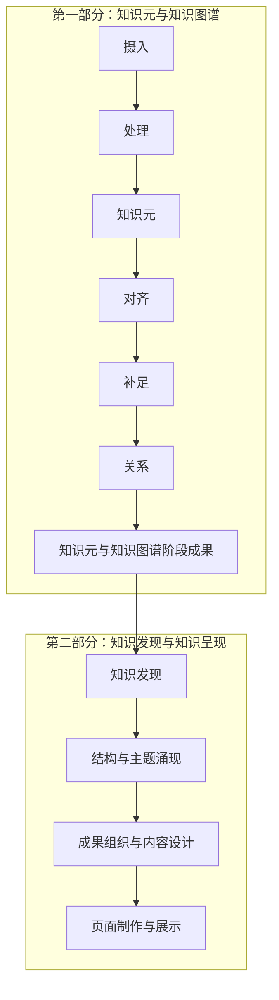

# 工作流程调整过程报告与用户修订记录

版本：v1.0  
记录日期：2026-09-09  
记录依据：本任务中的用户消息与方案讨论  
状态：前七节保留最初方案讨论快照；REV-005 已授权并实施本地重构，当前要求与验收见关联文件。

本文件保存用户原话、目的解释和方案变化，后续沿用本文件追加修订记录。原话不因后续总结而覆盖。当前有效要求集中见 [current-requirements.md](current-requirements.md)；具体实施及其验证完成后，另在现有系统升级日志中记录实际结果。

## 一、调整背景

讨论开始时，仓库采用生产、成长、治理三条循环，按事件进入相应 Skill。`ingest` 同时包含来源登记、语义阅读、候选判断和类型化写回；知识发现、层级演化也在现行路由内。

用户要求先明确初期范围和阶段责任，以语义分析为基础，并能在业务目录中查看处理过程、知识成果及完成情况。因此，本次讨论从“按事件分流”转向“明确阶段、依次执行、分别留存过程和结果”。

本报告记录的是这一调整的提出与讨论过程，不表示原有规则、Skill、数据或页面已经完成改造。

## 二、用户原话与目的解释

### REV-001：首次提出范围和记录要求

日期：2026-09-09。此消息后该轮被中断，随后用户补充了完整版本；两条均保留，不把中断消息记为已执行任务。

用户原话：

> 目前的流程需要限定。0项目要以语义分析为基础，尽量少用代码和脚本。1初期目标只进行知识元的摄入和关系关联，暂不进行知识发现的步骤。2每个环节都要按阶段执行。并形成相应的结果。（比如03-processing处理了什么，结果是怎样的，要保存在该文件夹，比如04）3我提出的修订意见要专门进行存储。原话和目的进行保存和总结。

目的解释（Agent 总结）：

- 让阅读、分析和判断成为工作的主体，减少脚本及其运行流程对研究工作的支配。
- 把初期目标限定为知识元及关系建设。
- 每阶段形成可阅读、可追溯的结果，并在相应业务目录保存。
- 建立专门的用户修订记录，区分原话与解释。

### REV-002：明确六阶段路径及只审阅边界

日期：2026-09-09。此条是 REV-001 的完整补充版本。

用户原话：

> 目前的流程需要限定。0项目要以语义分析为基础，尽量少用代码和脚本。1初期目标只进行知识元的摄入和关系关联，暂不进行知识发现的步骤。2每个环节都要按阶段执行。并形成相应的结果。（比如03-processing处理了什么，结果是怎样的，要保存在该文件夹，比如04-knowledge分析出了哪些知识元，完成度如何）3我提出的修订意见要专门进行存储。原话和目的进行保存和总结。4执行步骤还不够清晰，需要修订 按照 摄入-处理-知识元-对齐-补足-关系的路径进行调整。
> 你先看下要怎么做，先不要改。

目的解释（Agent 总结）：

- 明确六个阶段的先后顺序和职责，解决当前步骤不清晰的问题。
- 使 `03-processing` 能说明处理范围与分析结果，使 `04-knowledge` 能说明知识元产出和完成情况。
- 在实施前先审阅现状、提出调整方案；本条未授权修改实际流程。

### REV-003：明确两大部分、最终展示及版本原则

日期：2026-09-09。

用户原话：

> 知识发现和涌现是之后的步骤，最后有页面展示。
> 每个阶段形成的过程文档专门存储，最终版本和结果也要专门存储。原则上不新建文献，只做版本更迭。
> 总体上分为知识元&知识图谱/知识发现&知识呈现这两大部分。

目的解释（Agent 总结）：

- 知识发现和涌现属于后续正式工作，初期暂不开展，并非从总体流程中取消。
- 第一部分建设知识元与知识图谱；第二部分开展知识发现与知识呈现，最终包含页面展示。
- 每阶段的过程文档与最终成果分别保存，避免讨论、分析、暂定内容与当前有效成果混在一起。
- 同一对象沿用固定文档进行版本更迭，避免按轮次或日期不断复制同用途文档。

解释边界：用户原话中的“原则上不新建文献”在方案中暂按“同一对象不反复新建同用途文档，沿用固定文件进行版本更迭”落实；这不构成覆盖原始来源的授权，也不扩展为永久禁止引入必要来源。具体目录名称和第二部分的内部步骤仍属于 Agent 建议。

### REV-004：授权将调整过程形成报告

日期：2026-09-09。

用户原话：

> 把这个调整的过程形成报告。记录下来。

目的解释（Agent 总结）：

- 将此前停留在会话中的调整过程持久保存，便于后续核对要求与实施依据。
- 本次授权落实为本报告、当前要求汇总及必要的导航链接；实际流程、Skill 和知识内容的改造仍未实施。

## 三、方案如何演变

| 讨论节点 | 形成的认识或建议 | 当前地位 |
|---|---|---|
| 现状审阅 | 现行事件路由、ingest 内部职责和完整层级挂载要求，与用户限定的阶段路径存在冲突 | 后续实施时需要解决 |
| 第一轮方案 | 建议按“摄入—处理—知识元—对齐—补足—关系”执行，逐阶段保存范围、判断、产出、状态与缺口 | 六阶段路径来自用户；具体完成标准为 Agent 建议 |
| 第一轮记录建议 | 曾建议每次修订单独新建记录 | 被后续固定文档、持续版本更迭的方案替代，未实施 |
| 第二轮补充 | 知识发现与涌现位于后续阶段，最终有页面展示；总体分为两大部分 | 用户明确要求 |
| 第二轮存储方案 | 建议业务目录内分别设置过程与结果位置，实际成果维护唯一当前版本 | 存储分离是用户要求；目录命名尚属建议 |
| 第二轮记录建议 | 采用固定的 user-revisions.md 保存原话与演变，current-requirements.md 汇总当前要求 | 本次记录任务已落实 |

## 四、总体路径与阶段职责建议

第一部分的六阶段顺序来自 REV-002，两大部分及最终页面展示来自 REV-003。第二部分图示中的具体拆分和顺序是 Agent 的工作建议，尚未作为已实施流程。

| 阶段 | 过程记录重点 | 阶段结果重点 |
|---|---|---|
| 摄入 | 来源、版本、资产、处理范围与缺失材料 | 可进入阅读的来源清单及范围 |
| 处理 | 语义阅读、来源定位、论述与语境分析、歧义和遗漏 | 处理了什么、如何理解、提取依据及未解决问题 |
| 知识元 | 对象边界、类型判断、初步重复筛查、成稿依据 | 新增、更新、暂缓对象及有来源的知识元初稿 |
| 对齐 | 名称、别名、身份、年代、版本与重复或冲突的核对 | 对齐结论、依据、具体改动及保留分歧 |
| 补足 | 围绕既有知识元缺口进行必要阅读和补证 | 补充内容、来源、原书与外部补充的区分及剩余缺口 |
| 关系 | 端点、类型、方向、时间范围与具体证据的语义审查 | 已建立、待证、否决的关系及理由 |

对齐暂按对象同一性和表述一致性理解，不等同于全部事实验证，也不强制进行 Theme/Topic 层级归属。阶段结果保存后再进入下一阶段；无须补足或无证据充分的关系时，可以如实形成“已审查，无新增”结果。

## 五、存储与版本方案建议

过程文档解释“怎样分析和判断”；结果文档说明“当前结论、完成状态和成果位置”；实际知识元、正式关系、发现结论与页面在固定位置维护。结果文档引用实际成果，不再复制一套正文。

建议在 `03-processing`、`04-knowledge`、`05-outputs` 内分别组织对应业务的过程和结果，必要时采用 `process/` 与 `results/`；发现与涌现的落点结合现有 `04-knowledge/structure/` 决定。具体目录结构尚未创建或改造。

同一对象的文档使用固定路径，避免“最终版、最终修订版”或逐轮日期副本。过程记录保留判断变化，结果文件维护当前有效内容；Git 提交后可以进一步保留版本差异，但提交与推送仍须按授权执行。原始来源本体继续保留，不因版本管理而覆盖。

## 六、后续实际改造涉及的范围

- `AGENTS.md` 与 `.agents/pipeline.md`：写明初期范围、两部分结构和六阶段执行约束。
- `01-domain/workflow-overrides.md`：解决初期暂停知识发现与现行完整五级挂载要求之间的冲突。
- 相关 Skill：明确摄入、处理、知识元、对齐、补足、关系的职责、交接和阶段结果；不机械地为六阶段新增六套 Skill 或脚本。
- 业务目录说明：明确过程文档、结果文档和当前成果的唯一位置及引用方式。
- 必要校验：与新契约保持一致，保留来源和证据可追溯性，减少不必要的脚本编排。

以上属于后续实施范围，本次报告没有执行这些修改。

## 七、本次记录的完成边界

- 已保存本轮相关用户原话、目的解释、方案变化与尚未实施事项。
- 已形成独立的当前要求汇总，并建立运行层导航入口。
- 未修改实际执行流程、Skill、知识元、关系、来源或页面。
- 未重新进行来源语义验收，未提交或推送 Git；报告存在不等于流程改造完成。

## 八、持续记录与实施授权

### REV-005：Codex 单入口重构

日期：2026-09-09。

用户原话：

> 之后所有的我的对话和修订意见都记下来。
> 以agents.md也就是目前使用的codex为核心，整理工作流和skills系统。
> 目前系统中存在.claude .codex .agents 等多个系统。能删除删除，整个系统不要有歧义。
> 现在开始重构系统。不要冗余

目的解释（Agent 总结）：持续保存本项目后续可见的每条用户消息，不仅限于规则修订；以 AGENTS.md 为唯一总入口，Codex 为执行客户端，消除重复适配、重叠技能和相互冲突的流程规定。

授权范围：开始实施此前讨论的工作流与 Skill 重构，允许删除确认不再使用的系统入口、重复规范与适配；保留来源、知识成果及不可替代历史证据。此授权取代 REV-002 的“先不要改”阶段边界；不自动包含新的 Git 提交和推送。

记录边界：从本条开始，对本项目会话中 Agent 实际可见的后续用户消息逐条保留原话，再另写理解与处理结果；不声称能读取未提供的其他会话、系统消息或后台私有数据。无修订的普通消息也记录，不把它们自动升级为规则。

实施过程和验收结果统一见 [system-upgrade-log.md](system-upgrade-log.md)，本文件不复制执行日志。

REV-005 处理结果：本地 v6.0.0 重构已完成，当前系统与 Skill 边界见 AGENTS.md；验证结果见系统升级日志。未提交或推送。

### REV-006：目录结构与现行工作流的匹配评估

日期：2026-09-09。

用户原话：

> 目录结构是否需要根据现行工作流进行调整？

目的解释（Agent 总结）：检查当前目录是否真实反映六阶段工作流及两部分目标，识别历史目录分类、过程与结果落点中的歧义，评估必要的最小调整。

处理范围：目录与契约评估，记录结论；本轮不移动来源、知识或系统文件，不把询问自动解释为再次迁移目录的命令。

处理结果：需要局部目录与导航收口。保留 01–06 顶层业务目录和知识元唯一正文路径；建议扁平化八个 Skill 目录，摄入过程记录离开来源只追加区域，统一过程/结果命名，收敛输出层和空的全局运行目录。现行命名规范与输出 README 仍含旧目录说明，上一轮重构的机械检查未覆盖这类文字残留。具体发现见系统升级日志的目录评估节；本次未实施这些迁移。

### REV-007：从 01 开始实施目录修订

日期：2026-09-09。

用户原话：

> 应该从01开始吧，现在开始修订。

目的解释（Agent 总结）：目录修订应从 01-domain 的领域约束与命名规范开始，再依次落实后续业务目录，实施 REV-006 中评估的必要调整。

授权范围：修订现行目录职责与导航、迁移 Skill 并修复依赖，清理已核实无内容且无用途的旧目录；保留来源、知识成果和历史证据。未授权本次 Git 提交与推送。

处理结果：本地 v6.0.1 目录修订已完成，从 01-domain 起依次更新 01–06 职责，八个 Skill 已扁平迁移，冗余空目录已清理；246 项测试通过。过程、迁移映射与验收统一见 system-upgrade-log.md；未提交或推送。

### REV-008：质疑项目初期的高版本号

日期：2026-09-09。

用户原话：

> 各个文档的版本怎么那么高？这个项目还没开始

目的解释（Agent 总结）：指出当前高版本号与项目尚处于启动阶段的实际状态不符，需要解释版本来源，避免将继承系统的改版次数表现为本项目成熟度。

处理范围：核对与解释版本来源；本条询问不自动授权全仓版本重编号。

核对结果：高版本号混合了旧系统沿用的文档版本（例如 taxonomy-registry v4.0、语义协议 v4.2）和 Agent 在本项目两次系统整理中标注的 v6.0.0/v6.0.1。它们不是本项目研究成果迭代次数；将这些编号直接用于项目总入口与普通文档容易造成成熟度误解，属于版本管理处理不当。

建议：本项目初始化基线使用 v0.1.0；普通说明与规则文档取消独立数字版本，保留必要更新日期，以 Git 历史和既有修订日志追溯。机器读取的 schema/protocol 版本仅为兼容保留，不作项目进度标志；历史日志保留原编号并解释来源。当前实际状态为工作流初始化，已有第一章试点草稿不等于正式研究或验收完成。本轮已解释并记录，尚未更改版本编号。

### REV-009：知识涌现生成层级，而非预设层级

日期：2026-09-09。

用户原话：

> 你好像没有理解知识发现的机制，包括知识涌现。应该是通过知识涌现，哪些知识元组成了topic，哪些topic组成了them，哪些主题构成了维度，哪些维度构成了领域。不是实现设定的。你深度理解一下

目的解释（初步，待本轮审读后补充）：纠正 Agent 将知识结构理解为预设分类框架的偏差。具体 Topic、Theme、Dimension、Domain 应从知识元及其关系的分析中逐级涌现；不得先定结构再把知识元塞入框架。用户原话保留，解释中将 them 理解为 Theme，将“不是实现设定的”按上下文理解为“不是事先设定的”。

处理范围：深入审读现行层级与发现契约，厘清机制及冲突并记录；不启动知识发现、不修改既有知识成果。

处理结果：已核实预设 A–E 维度、预设 Domain、优先挂载及数量晋升门槛与用户所述机制不符，10 个试点 KU 的现有归属不能视为涌现结果。已在 current-requirements.md 记录 R-14，详细理解与冲突见 system-upgrade-log.md 的 REV-009 审读节。本轮只形成机制纠正与审读记录，未改写研究成果或启动知识发现。

### REV-010：按空项目审查完整工作流

日期：2026-09-09。

用户原话：

> 你再检查一下 agents.md和整个pipline和skills工作流是否合理
> 这是个空项目还没有执行，不要预先设定许多内容，但skills和前后关联的工作流的功能，工作内容，产出结果等规则要基本完备。

目的解释：以尚未正式执行的空项目为设计基线，不预设研究内容、具体层级或研究完成状态；同时要求 AGENTS、pipeline 和 Skills 的职责、输入、操作、产出及前后交接基本完备。

处理范围：审查并记录问题与必要修订方案；不运行摄入、发现或成果生成，不因空项目定位自动删除磁盘遗留材料。

处理结果：已完成 AGENTS、pipeline、八个 Skill 及关键直接契约审读，判断“主体分工可保留，但空项目起步、逐级涌现、阶段状态及交接/回退尚不完备”。具体问题、八 Skill 合同目标与修订顺序记入 system-upgrade-log.md 的 REV-010；需求索引已标记当前空项目定位和待实施事项。本轮未修改运行规则或研究成果。

### REV-011：检查过度设计、门禁与冗余，保留页面样式

日期：2026-09-09。

用户原话：

> 整个流程有没有过度设计，过多的门禁和审核？是否有冗余？页面样式可以保留，但是要根据新的数据进行调整。

目的解释：在 REV-010 的系统审查中进一步辨认不必要的门禁、审核与重复工件；保留现有页面视觉样式，但其内容、指标、筛选、层级及交互绑定必须使用本项目实际新数据，不继承旧项目研究结论。

处理范围：扩展当前审查并记录简化取舍和页面约束；不凭空生成研究数据，不因审查自动删除来源、历史证据或页面资源。

处理结果：确认存在批量机器流程默认化、重复结果工件和合同描述、历史兼容占据主流程等负担；同时现行规则已经取消默认逐阶段用户审批，不能误报为所有环节都要求批准。已形成保留基本证据条件、按需启用复杂检查的精简方案，页面保留样式并按新数据更新的要求已入需求索引。具体见 system-upgrade-log.md REV-011；本轮尚未实施精简或改页面。

### REV-012：先提交同步，再精简调整

日期：2026-09-09。

用户原话：

> 先提交并同步仓库。然后开始精简调整。

目的与授权：先提交并推送当前重构与审查记录，核验 main 与远端一致，再实施 REV-008 至 REV-011 已记录的版本、空项目、涌现、工作流精简及页面数据边界调整。后续精简修改先在本地完成，不将本次“先同步”自动扩大为再次发布。

处理结果：已先提交并推送 d07965d，核验 main 与远端一致；随后完成初始化精简。规则与 Skills 及参考规则从 3,075 行减至 1,776 行，补齐阶段交接并取消预设结构、固定审核及普通工作必走机器流程；项目改为 0.1.0。主页面保留样式并按有效成果清单呈现，当前为空。原始来源与遗留知识保留、不计当前成果。247 项回归及相应机械检查通过，页面验证的具体范围和剩余限制见 system-upgrade-log.md 本节。精简修改尚未再次提交或推送。

### REV-013：第一章和第六章第一部分测试

日期：2026-09-09。

用户原话：

> 先用第一章和第六章进行测试。先进行第一部分测试，知识涌现和网页先搁置

目的与范围：使用第一章、第六章测试摄入、处理、知识元、对齐、补足、关系六阶段，逐阶段保存过程与实际结果；暂停知识涌现和网页，不自动更新展示，也不提交推送。第一章遗留工件必须与本次重新阅读判断分开。

### REV-014：逐行语义阅读、跨页衔接与完整提取

日期：2026-09-09。

用户原话：

> 要进行逐行语义阅读与分析，注意断行和跨页，完整提取知识元。建议你一步一步的执行。

目的与调整：逐行语义阅读、恢复断行及跨页语义和脚注联系，完整提取章内可辨认知识元；不得仅选代表性对象。替代 REV-013 执行中的抽样成稿解释，49 个已写草稿保持未纳入有效清单，回到处理阶段逐章复核。先第一章、再第六章，之后逐阶段成稿、对齐、补足、关系；涌现与网页继续搁置。

### REV-015：先以第一章为样例

日期：2026-09-09。

用户原话：

> 先处理第一章，作为样例，第六章后面再做。

范围调整：当前仅推进第一章的逐行完整提取及第一部分阶段测试；第六章后置。此前第六章通读及草稿保留为未接收材料，不继续处理或并入第一章有效成果。跨章补足不能默认继续第六章，当前第一章无法确认的信息保留待证。

REV-013 至 REV-015 的本次处理结果：第一章完成 L1–980 全行语义阅读和正文/脚注/跨页处置，核对 PDF 疑难页并纠正 OCR 人名、费率、页码及脚注。271 张相关对象卡中，270 张知识元可在章内证据边界下使用，Borghese 合并身份候选 1 张暂缓；另登记 12 条复杂断言及 137 条有出处的有向关系。对齐与补足只声明本章实际核对范围，未明全名、作品版本和原典问题保留。结果及全部对象目录见 `04-knowledge/results/patrons-and-painters-chp-1.md`，摄入处理见相应 03 包。第六章专属 19 张草稿仍未接收，知识涌现和页面暂停，本次没有修改来源本体或提交推送。

### REV-016：复查提取完整性、厘清类型边界并改用 archive

日期：2026-09-09。

用户原话：

> 只有这么多知识元？有没有8类里面没有的？
> 有些边界你还能搞清楚？
> 比如 威尼斯 如果是地名 放入地点类，如果是威尼斯共和国，政治实体则放入机构。
> 建筑 放入地点  如果是建筑构件，图册，内部的艺术作品，比如雕塑，放入作品。
> 很多档案，文献放入publiction 这类其实命名为archive更为合适，所有文献，包括学术文献都放进去。

目的与处理范围：重新审查 270 张首次提取的粒度和遗漏，不以数量或逐行定位覆盖宣布完整。分类按语境中的对象身份：地名归 place，政治实体归 institution；建筑空间归 place，构件、艺术图册和内部独立作品归 work。文献与档案统一使用 archive，包含学术文献，替换原 KU 类型 publication。先核对规则、当前对象及直接依赖，保留历史来源；第六章语义测试、知识涌现、网页和提交推送继续暂停。

处理结果：已落实分类边界和 archive 类型/目录/工具迁移；补入 21 项文献与档案、3 处建筑、2 项作品，并以同书索引明确第 4 页 Scipione Borghese，既有候选具名接收。当前 297 KU、12 条断言、173 条关系。发现材料/设备实物、神话图像角色等类型表达边界并专门记录，未硬塞八类或预设新类。首次清单不作为完整提取证明，其他短引书目、身份版本仍须逐项判断。过程/结果沿用原路径；系统映射与验证见 system-upgrade-log.md REV-016。

### REV-017：外部补足与 Wikipedia—Wikidata 双重身份验证

日期：2026-09-09。

用户原话：

> 补足要根据Wikipedia，wikidata，gatty（不限于这些来源，其他官方来源也可以，一个实体要wikidata和Wikipedia双重验证，以防止错误的QID号码）
> 知识元内容现在是怎么做的？

目的与处理范围：补足应查阅 Wikipedia、Wikidata、Getty（将原话 gatty 暂按 Getty 理解）及适用的其他官方来源，不能把章内回读称为外部补足完成。每个实体要求 Wikipedia 与 Wikidata 双重核对，重点防止同名实体或错误 QID；缺少一侧时保留未完成状态，不以官方页面替代并冒称双重核验完成。同时说明当前知识元正文的来源、组织方式、实际内容与不足。本条不表示 297 个对象已经接受外部验证，也不自动启动第六章、涌现、网页或提交推送。

处理结果：verify/enrich 与 pipeline 已明确逐实体 Wikipedia—Wikidata 双向链接和语义身份核对，其他官方来源按问题补证；正文说明保留本书记载与外部内容的证据区别。纠正按类型参考中遗留的 Publication 及不适用的文献标识要求。第一章结果明确来源内补漏与尚未执行的外部补足；本次未核验具体实体、添加 QID 或修改 297 KU/12 断言/173 关系的内容与状态。现有采集器尚不自动核对双向 QID，实际执行依 verify 直接阅读与记录。系统改动与检查见 system-upgrade-log.md 的 REV-017。

### REV-018：知识元标题与描述中英文对照

日期：2026-09-09。

用户原话：

> 知识元内容中的关键信息，比如 title要中英文。描述也要中英文。那不勒斯（Naples）

目的与处理范围：知识元关键展示内容采用中英文，标题以“中文名（English name）”呈现，描述提供语义对应的中文与英文。先统一现有字段与正文规则，并在那不勒斯条目落实；不把双语编辑当成外部身份验证，也不据此声称其余条目已全量改写。

处理结果：AGENTS、ingest 字段/正文规则及 enrich 已规定标题与描述中英文对应，沿用 title/name_en 与同一正文。那不勒斯已按第一章来源写成双语样例，其余既有 KU 未全量改写；不添加外部验证状态。过程及当前结果分别更新在 04-knowledge 原有文件。

### REV-019：知识元统一元数据与按类型结构化内容

日期：2026-09-09。

用户原话：

> 知识元内容原则上分为3个部分：
> 元数据部分，记录来源，行数类型等等元数据。各类知识元这部分应当保持统一。
> 内容部分包括描述，具体内容和信息。要结构化，有描述，也要有条目化的数据（或字段，你来判断）。比如，人物：要有姓名以全名为主（称号，昵称，别名，荣誉头衔，贵族头衔也要列进去）生卒年，国籍，亲缘关系，学术履历，作品清单，评价者，相关研究著作论文清单，等等。比如作品，要有创作者，作品名，创作时间，创作地点，材质，作品描述，赞助人，存放地等等。比如建筑，要有设计师，各个历史时期的所属权变化，各个历史时期的名称，所在地，等等。

目的与处理范围：各类 KU 采用统一来源/定位/类型等元数据外壳，内容采用双语描述与按类型的结构化属性、列表和历史记录。人物全名优先，其他名称和头衔分清性质；人物、作品、建筑所列项目作为需审视的内容范围，未知信息保留缺口。用户已明确前两部分，第三部分未说明，已询问；先落实不依赖其回答的前两部分，不把“关系与证据”建议记成用户决定。

### REV-020：确认第三部分为关系与证据

日期：2026-09-09。

提问背景：REV-019 提及三个部分，但原消息只展开元数据和内容；助手询问第三部分是否为关系与证据。

用户回复原话：

> 第三部分是关系与证据

目的与决定：知识元三部分正式确定为元数据、内容、关系与证据。取代 REV-019 实施期间的第三部分待定状态；关系与证据区分正式关系、支持具体内容的依据及未决项，不另维护冗余副本。

REV-019、020 共同处理结果：三部分结构已落实至 AGENTS、pipeline、ingest 字段/正文规则和 enrich/关系直接依赖。按类型列出内容审视范围，采用简单字段、重复项目列表与历史变化表；不新增类型数据库或重复关系存储。圭尔奇诺条目已原位整理为样例，未核信息列缺口；其余 KU 尚未全量改写。第三部分现已明确，前述待定只是过程历史。

### REV-021：知识处理过程统一迁入 03-processing

日期：2026-09-09。

用户原话：

> 04中的process应该放在03-processing中，

目的与处理范围：将原 04-knowledge/process 中的知识处理过程记录移入 03-processing 相应任务包，04-knowledge 保留知识成果与结果说明。同步 AGENTS、pipeline、Skills 和当前引用，保留历史记录与业务内容；不启动第六章研究或刷新网页。

处理结果：两章原过程记录均已移入 03-processing 对应任务包的 process/knowledge.md，迁移时 SHA-256 一致；第一章文档随后只修正两处相对链接。原过程 README 的职责合并进 03-processing/README.md，移除旧 README 和空的 04-knowledge/process。AGENTS、pipeline、相关 Skills、目录规范和结果链接已同步；历史原话/日志保留旧路径作为历史，不作为当前入口。未处理第六章内容，未修改知识元或刷新页面。

### REV-022：全面核对入口、Skills 路径与渐进式分布记录并升级

日期：2026-09-09。

用户原话：

> 全面看下agent.md和各个入口，skills路径等是否正确。是否采取了渐进式分布的记录方式。
> 根据现有的调整进行升级

目的与处理范围：全面检查唯一 AGENTS.md 入口、pipeline、目录导航、Skills 及直接依赖是否可达且符合 REV-016 至 REV-021 的新约定；检查按需逐层读取、记录按职责分布、过程增量保留与结果原位更新，修复当前冲突和断链。不把系统升级等同于研究批量改写、外部补足或页面发布；保持初始化版本及既有历史。

处理结果：已完成入口、8 个 Skill、25 份直接参考及相关存储/写回接口核对。修复旧过程路径、未执行状态、预设结构和退役入口等冲突；渐进式读取与分布记录以 AGENTS/pipeline 为准，详细发现和 62 项相关回归结果集中记录于 system-upgrade-log.md REV-022。当前要求索引已精简，原始来源和冻结页面指纹不变；未进行研究批量改写、外部补足或提交推送。

### REV-023：小提交并同步仓库

日期：2026-09-09。

用户原话：

> 小提交并同步仓库

目的与执行范围：授权将当前已完成的本地改动按主题拆分提交并推送 main，核对远端状态及最终一致性。不重新执行研究或刷新暂停的页面；历史未提交页面变更按已有内容提交，不等于本次生成新页面。

### REV-024：按一次提交同步仓库

日期：2026-09-09。

用户原话：

> 提交并同步仓库不需要“小提交”

目的与执行范围：覆盖 REV-023 的拆分提交方式，将当前累计改动统一提交并推送 main。同步前已 fetch，HEAD 与 origin/main 无分歧；只读全量检查通过，254 项测试通过。内容审计仍提示草稿字段等缺口，机械检查不代表语义完成。本次不刷新暂停的页面。

### REV-025：询问第一章完成情况与进度

日期：2026-09-09。

用户原话：

> 第一章做完了么？进度如何

目的：了解第一章研究工作的实际完成情况，区别仓库同步和研究完成。

核对结果：第一章尚未全部完成。摄入及 OCR L1–980 逐行语义阅读已有过程与结果；当前登记 297 个知识元、12 条复杂断言、173 条有出处的有向关系，但未证明提取穷尽。身份与书目对齐部分完成；外部 Wikipedia—Wikidata 双重身份验证及 Getty/官方补足尚未开始。双语标题/描述与三部分内容结构只完成样例，未覆盖全部知识元。下一步应先完成来源内遗漏与边界复核、现有知识元结构和双语整理，再推进对齐补足并复核关系。第六章、知识涌现与页面仍暂停。本次仅核对进度和记录问答，不推进研究阶段。

### REV-026：继续初步对齐与补足

日期：2026-09-09。

用户原话：

> 对齐只是初步对齐，补足之后很多详细信息会比较完善。继续对齐和补足

目的与执行范围：明确第四阶段只作初步身份对齐及冲突识别，不以详细字段完整作为进入补足的前提；授权继续第一章对齐和外部补足，详细信息在第五阶段按证据完善。第六章、知识涌现及页面仍暂停。

### REV-027：Wikidata 字段与 Wikipedia 全文分工

日期：2026-09-09。

用户原话：

> 双向身份核对后，可从wikidata提取实体所需的各类字段，而其他部分可以通过Wikipedia页面，全面阅读后进行提取。

目的与执行范围：双向身份核对通过后，读取 Wikidata 实体的适用属性、限定词和引用；Wikipedia 对象页须完整阅读后提取叙述内容，不以搜索摘要或局部段落替代。官方来源按具体缺口补证；事实、来源差异与未解决项分别记录。继续第一章，不启动第六章、涌现或页面。

REV-026、027 处理结果：已修订相应阶段分工并推进首组五卡。身份核对、全文阅读、字段采用及受阻项的实际过程统一保存于 03-processing/patrons-and-painters-chp-1/process/knowledge.md；当前进度与成果链接维护于 04-knowledge/results/patrons-and-painters-chp-1.md。未将部分补足记作第一章完成。

### REV-028：多角色标签、双语信件标题与 Wikipedia 语言次序

日期：2026-09-09。

用户原话：

> 各类实体可能有多个标签，不要死板，比如 赞助人 贵族 诗人 教育者 都可能在一个人身上，可以用标签的方式作为人物属性，具体要等到第一批的结果出来以后再进行详细调整。
> Fulvio Testi 致 Francesco Fontana 信 这类表述不规范，中英文对照
> 查询Wikipedia的时候首先按照英文页面查询，如果没有，根据实体的来源国家，比如意大利，德国，查询不同语种的Wikipedia
> 现在知识元内容补足都完成了？

目的与执行范围：允许同一实体具有多个有据角色／身份标签，先保留灵活表达，不提前建立细分标签体系，待第一批结果后调整；修正混合语言的信件标题为完整中英文对应；明确 Wikipedia 英文优先，无英文对象页时按对象来源及语言背景查询相关语言版本，并继续核对身份；核实和说明实际补足进度。

### REV-029：开始补足

日期：2026-09-09。

用户原话：

> 开始补足

目的与执行范围：继续实际执行第一章知识元补足，承接已有成果和 REV-028 的多角色、双语命名及语言回退要求，优先处理已开始对象的配对与字段缺口，再推进未补足对象；不以规则整理代替研究执行。第六章、发现与页面继续暂停。

### REV-030：来源的章节、页码与句子摘要

日期：2026-09-09。

用户原话：

> 在文档中的来源也要记录，第几章，第几页，句子摘要。

目的与执行范围：知识元来源需让读者直接看到章节、印刷页和支持该对象／事实的句子摘要，保留行号及证据范围；摘要为转述，不冒充逐字引文。同一卡不同段落分别归源，网页没有章节页码时按实际页面／小节定位，不虚构书籍位置。继续在实际补足中落实。

REV-028–030 处理结果：多角色、双语信件标题、英文优先及来源章页／摘要规则已落入对应直接契约，未新增规则副本或标签体系。实际补足和逐项证据处理见 03-processing/patrons-and-painters-chp-1/process/knowledge.md 同编号段；当前覆盖、未决项及八卡链接见 04-knowledge/results/patrons-and-painters-chp-1.md。不把部分补足或来源字段存在写成全章完成。

### REV-031：总体进度与下一步

日期：2026-09-09。

用户原话：

> 总体进度和下一步工作？

目的与处理：核对当前成果、有效登记和工作树，区分来源阅读、知识元提取、身份配对、外部补足与关系状态，并给出下一步执行顺序。本消息为进度询问，不新增研究范围或提交授权。当前结果及下一步维护于 04-knowledge/results/patrons-and-painters-chp-1.md；已读全文不代表提取穷尽，部分补足与机械检查不代表全章语义验收。

### REV-032：按阶段收口、定稿与清理

日期：2026-09-09。

用户原话：

> 按照顺序分步骤执行：
> 比如，先进行摄入与处理，并保存最终版结果。清理过程文档。
> 比如，在进行知识元登记，保存最终版结果。清理过程文档。
> 依次进行。从第一步开始。

目的与执行：从第一章摄入与处理开始按阶段收口，每阶段保存唯一当前定稿，再清理重复、过时的过程叙述及无用中间产物。原始来源、用户原话、关键证据和裁决须可追溯；最终版沿固定路径更新，不复制带日期或版本号的同用途文件。当前先完成摄入与处理，不继续并行扩展对齐、补足或关系；已有下游成果保留，后续按顺序复核交接。

处理结果：第一步已在原 results/stages.md 保存来源、80 个逐行语义跨度、章页／句意摘要、校正及交接缺口；过程文件压缩为必要裁决，退役已由定稿取代且在 Git 可恢复的五件旧工件，清理派生候选入口。实际证据及检查见同任务 process/stages.md。下一步为知识元登记，本轮未将既有下游成果重新标记完成。

### REV-033：继续知识元登记

日期：2026-09-09。

用户原话：

> 继续

目的与执行：承接 REV-032，进入第二步知识元登记，以摄入处理定稿逐项核对现有对象、来源、分类、重复及待决事项；保存登记阶段当前定稿，再整理该阶段过程。后续身份对齐、外部补足和关系处理依次开展，不将本消息解释为提交推送或启动第二部分。

处理结果：本步按 ingest 完成知识元登记收口：289 张早期卡原位整理为双语、三部分、已有结构化内容及分段来源摘要；保留 8 张已补足卡，新增“新闻纸”术语，现为 298 KU。12 条断言、173 条既有关系未改。登记定稿、对象目录和逐项暂缓理由存入原 04 结果文件；03 知识过程合并重复历史叙述，保留外部阅读证据。下一步初步对齐；本轮未外部采集、未动第六章或页面，也未提交推送。

### REV-034：执行初步对齐

日期：2026-09-10。

用户原话：

> 执行下一步

目的与执行：承接知识元登记定稿，进入第一章初步对齐；复用已有身份比较与双向核对证据，逐项检查名称、对象边界、同名及版本，尝试适用的 Wikipedia／Wikidata 身份配对，保存可用、待证与冲突裁决。详细内容补足与正式关系仍依次后置；不包含 Git 提交推送、第六章、发现或页面。

处理结果：298 卡均已原位保存对齐结论，160 项身份语义比较及双向配对通过，138 项保留检索、身份、范围或版本缺口；18 项规范显示名更新，旧名和稳定路径保留。逐项证据集中存入 03 的 alignment-evidence.jsonl，04 原结果文件更新为初步对齐定稿及补足交接；未新增 KU 或关系。结构、来源保留及本地链接检查通过，不等于全部语义验收或详细补足完成。下一步进入补足，本轮未提交推送。

### REV-035：讨论家族分类

日期：2026-09-10。

用户原话：

> 是否考虑加入家族这个知识元分类？简要回答

目的与处理：评估现有八类能否准确表达家族。建议新增 family，表达以血缘、婚姻、收养及历史认同维系的家族与支系；人物归 person，家族成员关系连接二者。同姓不自动归族，家族与含雇员、侍从的家户／随从组织应按语境区分。本消息是讨论，尚未修改类型契约或迁移知识元。

### REV-036：执行家族分类扩展

日期：2026-09-10。

用户原话：

> 好，执行

目的与执行：承接 REV-035，加入 family 类型，明确家族、成员及家户边界，同步字段、Skills 和直接工具依赖，并审查现有家族对象；不自动生成成员关系或启动后续研究。

处理结果：family 已加入分类、共享字段、内容、身份核对及关系契约；三张明确家族卡迁入 families，保留 slug 与既有证据。巴贝里尼混合家族／家户条目继续明确待对齐，不自动拆卡或造边。直接工具适配及 47 项定向测试通过；当前结果及必要索引已更新。未采集新外证、未开展详细补足、未刷新页面或提交推送。

### REV-037：继续补足

日期：2026-09-10。

用户原话：

> 继续

目的与执行：承接初步对齐与家族分类修订，进入补足阶段；先处理三张已配对家族卡，完整阅读适用 Wikipedia 对象页，结合已配对 Wikidata 的适用字段及官方来源，原位保存结构化内容、证据和缺口。阶段未收口前不转关系、涌现或页面。

处理结果：三张已配对家族卡已原位保存双语与结构化补足稿，实际读取两页英文及一页意大利文 Wikipedia 全文，并提取对应 WD 适用字段、阅读馆方／研究资料。保留创始人、成员年代、继承与规范标识的缺口；婚期异文按有据研究作采用判断，170 人家户未误作亲属数，校正一条原文句意摘要。过程和证据在 03、当前内容和状态在 04；详细外部内容覆盖为 11/298，阶段仍进行中。必要检查通过，未新增 KU 或关系，未提交推送。

## REV-038｜2026-09-10｜提交同步后继续补足

用户原话：

> 提交并同步，然后进行下一步工作

目的与处理：先保存当前第一章阶段整理、初步对齐、家族分类及补足成果，提交到 main 并推送、核验远端一致；随后按当前结果指针继续圭尔奇诺、多梅尼基诺和兰弗兰科的补足，保留具体字段缺口与证据差异。执行结果续记于本条和业务过程记录。

执行结果：先完成提交 `6488aaaf2e217e5c6381e951aeb225035df1eae3` 并推送 main，实际远端 SHA 与本地相同，同步时工作树干净；47 项相关测试通过。随后三位画家的本组字段、亲缘／履历和来源差异已原位保存，过程归入 03，当前结果归入 04。详细内容覆盖仍为 11/298，不将已有卡深化计作新完成卡；同步后的本组修改尚未再次提交。下一对象为那不勒斯，仍处于补足阶段。

## REV-039｜2026-09-10｜询问下一步工作

用户原话：

> 下一步工作？

目的与答复：询问当前阶段的后续安排，本消息不自动新增规则或启动执行。核对当前结果与那不勒斯卡后，下一项仍为那不勒斯的适用 WD 属性、城市／历史政权／遗产地边界及研究书目核对；保存 03 过程、04 原卡与结果后，按第一章来源次序继续其他对象。补足交接后再做关系审查，第六章、涌现和页面继续后置。

## REV-040｜2026-09-10｜查看补足内容

用户原话：

> 补足的我看看

目的与处理：展示当前已保存的补足稿供审阅。打开圭尔奇诺、多梅尼基诺和兰弗兰科三张人物卡，摘示实际新增的亲缘、履历、作品属性及来源异文；说明元数据、内容、关系与证据的位置。本条为查看请求，不据此继续外部采集、改变事实或提升完成状态。

## REV-041｜2026-09-10｜先查看按字段组织的实体框架（本轮补记）

用户原话：

> 你先别做任何改动，先告诉我各类型实体的存储格式，现在很多东西都混在一起。
> 建议分字段。比如 姓名字段 全名 管用名 头衔 分条列出来 比如亲缘关系 父亲 母亲 配偶 女儿 儿子 比如身份 画家 素描家
> 比如基本信息 性别 生年 卒年 出生地 去世地 国籍 以此类推&#x20;
> 职业履历 按条目撰写 比如 1607 师从·····  1621-1623 ····· 1624 迁居···· 1629··· 出任 1644 购置&#x20;
> 你先按这个逻辑给我一个框架

目的与当时处理：要求先说明格式、展示分组字段和时间条目框架。当时只读核对并在会话答复，遵从“别做任何改动”，没有追加记录或改文件；本轮收到后续修订授权后补记，未冒称当时已落地。

## REV-042｜2026-09-10｜统一各类实体的字段与条目框架

用户原话：

> 其他几类实体也按照这个逻辑进行修订。

目的与执行范围：将上一条讨论的独立字段、多值列表、按时间逐项记述逻辑落实到其余实体类型，并与人物框架统一。修订唯一正文模板及必要的入口说明；过程记录、事实字段和证据分开。既有知识元在后续实际整理时按新模板逐卡迁移，本轮不批量改写研究内容，不提升成果状态，不提交推送。

执行结果：九类实体分组字段与条目格式已在唯一 body-template 原位修订，建筑增加专用小节；ingest、enrich、元数据边界及 pipeline 的直接说明已同步，R-31 索引要求。八个 Skill 入口、模板结构和相关链接检查通过；既有六张已补足卡指纹不变。详细系统过程见 system-upgrade-log REV-041–042，未把模板更新记作知识元补足完成，未提交推送。

## REV-043｜2026-09-10｜讨论关系字段与实体链接

用户原话：

> 关系你打算怎么做？加一个关系的字段？把相关知识元链接写入？

目的与答复：说明既有 relations 字段和正文实体链接如何配合。建议沿用唯一 relations 列表，每条有关系类型、目标知识元、必要时期／角色及具体证据，源实体由本卡确定；正文亲缘、作品等字段提供可读链接，关系部分引用同一事实依据。说明当前父母／配偶等具体亲缘谓词尚需核对／补齐受控词表，不能将链接当作已成立关系；反向展示用派生索引，不重复人工维护。本条仅讨论方案，未改关系类型或知识元数据。

## REV-044｜2026-09-10｜询问下一步工作建议

用户原话：

> 下一步工作建议？

目的与建议：在九类模板已修订、既有卡尚未按新格式整理且关系表达仍为讨论方案的状态下，建议先将一张已补足人物卡原位整理为字段化样例，再以已有作品、文献或家族卡检验其他类型；同时仅核对样例需要的关系类型及方向，不提前开展第六阶段正式关系扩展。记录真实缺口后继续那不勒斯及其他对象补足。先复用既有材料检验可读性、字段边界和证据保留，不为改格式重新检索或增加完成计数。本条为建议答复，未启动卡片转换、修改关系词表或提交推送。

## REV-045｜2026-09-10｜执行字段化样例与后续补足

用户原话：

> 执行1-4

目的与执行：按 REV-044 顺序完成圭尔奇诺字段化样例、样例关系表达核对、作品／文献／家族各一张原位整理，随后按新格式继续那不勒斯补足及可用对象。复用已读材料，保留事实、来源、正式关系和历史裁决；格式调整不计为新的外部补足或事实验证。过程在 03、当前结果在 04，未授权额外提交推送，第二部分继续暂停。

处理结果：四项已执行。四张类型样例原位字段化并核对关系表达；那不勒斯继续补足，另完成格列高利十五世首轮详细内容稿。共更新六卡，详细补足覆盖 12/298，新增一页英文 Wikipedia 全文阅读；来源及未决项分项保留。过程见 03 的 knowledge.md REV-045，当前成果见 04 的第一章 results。本轮未提交推送。

## REV-046｜2026-09-10｜确认人物卡的补足状态

用户原话：

> 这个是补充过的结果吧，这个人的

目的：确认刚展示的圭尔奇诺人物卡是否已经包含外部补足内容。

处理结果：核对当前卡后确认，这是本章提取、外部补足及最新字段化整理后的当前结果。Wikipedia—Wikidata 身份配对已完成，已有生卒、亲缘、师承、履历和研究文献等补充；最近一轮对该卡主要整理格式。完整作品清单、完整亲缘和头衔、具体委托实物及部分日期／账簿问题仍待补，不能称全面补足完成。本次仅解释状态并记录对话，未改人物卡。

## REV-047｜2026-09-10｜确认 QID 与 Wikipedia 链接

用户原话：

> Qid 和Wikipedia的链接都有吧

目的：确认圭尔奇诺人物卡保存了外部身份标识及可点击链接。

处理结果：当前卡“关系与证据 → 身份与证据范围”已保存 Wikidata Q334262（https://www.wikidata.org/wiki/Q334262）和英文 Wikipedia Guercino（https://en.wikipedia.org/wiki/Guercino）链接，并记载已有双向身份配对结论。本次核对的是本地卡片的链接保存情况，未重新访问外站或改写人物卡。

## REV-048｜2026-09-10｜补齐关系段的知识元链接

用户原话：

> 为什么关系链接没有写在里面？

目的：指出圭尔奇诺卡的关系段没有直接可点击的关联知识元入口。

处理：正式关系虽已在元数据保存目标路径，正文却只写了对象名称和过程链接，是字段化整理的显示遗漏。将正文既有计价关系的对象名称改为对应知识元链接，保留关系事实及证据；没有把尚未形成正式关系的内容字段升级为图谱边。

## REV-049｜2026-09-10｜同步已有成果后更新系统

用户原话：

> 提交并同步仓库。然后更新一下系统

目的与执行范围：先提交当前累积成果并推送 main，核验远端一致；随后基于实际样例完善知识元的身份链接、关系导航与补足状态表达，检查总入口、pipeline 和直接相关 Skills 的衔接。沿用现有规范和固定路径，不新增审核层、客户端入口或规则版本。系统更新过程与结果仅记录 system-upgrade-log，业务补足及第二部分不自动扩展。

处理结果：前序成果已提交并同步至 b557919，实际远端 main 与本地提交一致；之后完成系统规则与导航调整，八个 Skill 及规则漂移检查通过。系统更新为后续本地改动，详细范围、验证与限制见 system-upgrade-log 的 REV-049；未将规则更新计作业务补足或全库迁移。

## REV-050｜2026-09-10｜核对第一章第一部分完成状态

用户原话：

> 第一章从摄入到关系的流程走完了么？第一部分工作

目的：确认第一章是否已完成摄入、处理、知识元、对齐、补足、关系的完整第一部分，而非仅完成近期样例或系统修订。

处理结果：核对当前 stages 与知识结果后，确认尚未走完。摄入与处理已定稿，298 个知识元的章内登记已定稿，初步对齐带未决项交接（160 项配对通过、138 项未确认）；详细外部补足覆盖 12/298，已补卡仍有缺口，另 286 卡尚未详细补足。已有 173 条正式关系，但未完成补足后全章关系阶段的统一处理与收口。近期“完成”指指定的样例整理、局部补足及系统维护，不表示第一部分完成。下一步仍是继续补足并保存阶段结果，再处理关系。本次只核对状态及记录对话，不提升任何完成状态。

## REV-051｜2026-09-10｜讨论初步对齐与后续补足的推进顺序

用户原话：

> 后续怎么推进？先完成4．初步对齐  还是怎样？

目的：明确是否应先解决全部初步对齐未决项，才能继续补足。

建议：沿用已保存的初步对齐阶段结果，继续第 5 步补足，不把所有对象都有 QID 作为对齐收口条件。160 项已配对对象按本章顺序补足；138 项依已有未决原因，在处理到相关对象时先解决影响字段采用的同名、版本或范围问题，必要时回 verify。已找到有据内容但暂未找到 Wiki 配对的对象可保留明确来源支持的内容和未决状态，不借用其他对象 QID；关键身份不明时不导入依赖该身份的属性或生成相关新边。不重复同一检索或另设一轮全库审核。每批原位更新卡片、过程与当前结果，区分实际补入、未解决及可交关系的内容；全章补足有明确结果和未决去向后，再集中处理第 6 步关系。本次为推进建议，未自动开展新一批外部查询或改动阶段状态。

## REV-052｜2026-09-10｜连续推进第一章补足与关系

用户原话：

> 行，执行1-4，不要分太多批次

目的与执行范围：执行 REV-051 的四项推进建议，沿用已有初步对齐，连续完成适用对象补足、必要的身份补查和逐项结果保存，然后集中处理第一章关系。减少人为拆批，不按少量对象反复停止或申请许可；过程集中在既有任务包，事实、阅读与未决状态逐项记录。关键身份不明的字段和新关系不强行采用，处理过仍缺证不冒称解决。第六章及第二部分继续暂停。

## REV-053｜2026-09-11｜提交并同步当前仓库

用户原话：

> 提交并同步仓库

目的与执行范围：将当前已保存的系统修订、第一章连续补足、过程证据及结果状态一并提交到 `main`，推送至 `origin/main`，并单独核验本地与远端提交一致。本次同步不把尚未完成的第一章补足或集中关系阶段标记为完成。

## REV-054｜2026-09-11｜继续第一章补足

用户原话：

> 继续

目的与执行范围：延续 REV-052 已授权的第一章连续推进任务，从第 5 步补足继续处理适用对象；在全章补足形成明确结果和未决去向后，集中执行第 6 步关系。沿用固定卡片、过程和结果路径，不新增批次文档，不启动第六章、知识涌现或页面工作。

## REV-055｜2026-09-11｜同步当前成果并完成剩余知识元对齐与补足

用户原话：

> 提交并同步仓库，完成所有剩余的129个知识实体的对齐，补足。

目的与执行范围：先将当前十二张人物补足、过程证据、结果进度和用户修订记录提交至 `main` 并推送，单独核验 `origin/main` 一致；随后连续处理第一章剩余129个知识元的必要身份补查、Wikipedia—Wikidata双向核对及外部内容补足。完成表示每个对象均形成有依据的详细内容或明确且有检索范围的未决结论，不要求所有对象强行取得QID，也不把无法配对或无法核实的字段虚构为已解决。补足阶段收口后再按既定顺序进入集中关系审查；第六章、知识涌现和页面继续暂停。

## REV-056｜2026-09-11｜按实体类型扩展对齐与补足来源

用户原话：

> 并不是所有的实体都能有QID，可以扩大数据库的类型与范围，不仅限于Wikipedia和wikidata。相关的数据库，意大利人物数据库，等等，尤其是文献类，Internetarchiv等网站。

目的与执行范围：将对齐改为按实体类型进行身份、版本与粒度判断，QID和Wikipedia均为可选入口，不作为所有实体的完成条件。人物优先纳入国家／专业人物辞典、规范库及档案生产者记录，意大利人物包括Treccani《意大利人传记辞典》等；文献与档案优先纳入保管机构、图书馆联合目录、手稿目录及可核版本的数字化全文，包含Internet Archive等。采用任何数据库记录都须说明其能支持的是身份、书目、原件内容还是具体事实，不能因有链接或标识符就提升整卡状态。

## REV-057｜2026-09-11｜提交并同步类型化数据库规则

用户原话：

> 提交并同步

目的与执行范围：将REV-056形成的AGENTS、pipeline、verify、enrich、按类型来源表、正文身份入口、有效要求索引及治理记录提交到`main`，推送至`origin/main`并单独核验远端一致性。本次同步不启动新的实体补足、关系、发现或页面阶段。

## REV-058｜2026-09-12｜修复main分支Quality gate失败

用户原话：

> [fengbaifan/PNP-Final-DATA – Quality gate #9](https://github.com/fengbaifan/PNP-Final-DATA/actions/runs/34570941693?notification_referrer_id=NT_kwHOB7smzdoALFJlcG9zaXRvcnk7MTM2MTQyNzAwOTtDaGVja1N1aXRlOzkzNjQ5OTQwNDcz&notifications_query=is%3Aunread)
>
> [Quality gate workflow run failed for main branch](https://github.com/fengbaifan/PNP-Final-DATA/actions/runs/34570941693?notification_referrer_id=NT_kwHOB7smzdoALFJlcG9zaXRvcnk7MTM2MTQyNzAwOTtDaGVja1N1aXRlOzkzNjQ5OTQwNDcz&notifications_query=is%3Aunread)
>
> 9 hours ago
> 这什么意思，修复这个问题

目的与执行范围：读取GitHub Actions运行34570941693的失败步骤和日志，复现并修复导致main质量门禁失败的实际问题，运行相应本地检查；为使远端门禁重新执行，将修复提交并推送到main，再核验新的远端运行结果。不得通过删除有效检查或降低证据要求制造通过。

## REV-059｜2026-09-12｜询问第一章第一部分完成状态

用户原话：

> 第一章 第一部分工作是否已经完成?

目的与处理范围：依据第一章当前结果、阶段过程记录和有效知识元登记，分别核对摄入、处理、知识元、对齐、补足与关系六个阶段；区分已形成当前成果、机械检查通过、仍待语义收口的工作，不以数量或质量门禁通过代替第一部分完成判断。本次仅报告状态，不改写研究内容或阶段结论。

## REV-060｜2026-09-12｜执行第一章关系阶段集中审查与定稿

用户原话：

> 执行关系阶段的集中审查和结果定稿

目的与执行范围：以第一章298个有效知识元、补足后的内容与证据、原章逐行处理结果及现有173条正式关系为范围，集中复核端点、类型、方向、时间／语境和证据支持；判断补足阶段形成的关系线索是否应新增、暂缓或否决，原位更新正式关系及卡内可读关系展示，并在既有过程和第一章结果中保存正式、待证、否决及未解决结论。完成后形成第一部分当前定稿；不启动知识发现、知识涌现、第六章或页面工作。

## REV-061｜2026-09-12｜现有知识元及关系的语义分析

用户原话：

> 对现有知识元进行语义分析，重点分析关系。

目的与执行范围：以第一章298个有效知识元和REV-060定稿的219条正式关系为对象，分析知识元之间实际表达的语义结构，重点检查关系词的具体含义、方向、证据适配、角色区分、网络集中与孤立状态，并形成可追踪的审查结论。发现具体错误时回到关系阶段原位修订；关系模式或潜在线索不自动升级为Topic、Theme、Dimension或Domain，不启动知识发现、第六章和页面工作。

## REV-062｜2026-09-12｜追问人物作品清单、作品实体与创作关系

用户原话：

> 师承关系，合作关系，创作关系，隶属关系，比如卡拉瓦乔，实体内容中为什么没有作品清单？查询Wikipedia的时候是否读全了页面？如果有作品，作品的实体呢？创作关系呢？

目的与执行范围：核对人物卡内容字段、Wikipedia全文阅读证据、已登记作品知识元和正式创作关系是否一致，不能以页面已读或既有关系全部可解析代替内容到实体、实体到关系的完整转化。以卡拉瓦乔为首个反查样例，同时检查师承、合作、创作和隶属等有据事实是否因缺端点或宽泛谓词而遗漏；据实际缺口修正第一章完成状态和阶段交接规则。

## REV-063｜2026-09-12｜全盘审查作品位置、赞助、朋友与亲缘关系

用户原话：

> 比如卡拉瓦乔的作品，又存放 安置 在 某作教堂中，也构成关系。赞助关系，朋友关系，家族，家庭成员之间的关系？都要全盘考虑。

目的与执行范围：关系审查须从已采纳内容反查作品的创作者、委托／赞助、创作地点、原定或历次安置、所有权、机构保管和实际存放地，以及人物的师承、合作、朋友、亲缘、家庭／家族成员、任职／机构隶属等事实。每条正式关系保留端点、具体角色、方向、时间／版本语境与证据；缺少可独立识别端点时回知识元阶段，不把关系说明中的名称当作已建图谱，也不递归扩张所有外链。

## REV-064｜2026-09-12｜全面审核项目进度

用户原话：

> 先全面审核检查一下项目进度。

目的与执行范围：对照有效对象、阶段产物、阅读与采用证据、关系和系统接口及本地／远端状态，审核第一章各阶段实际进度。区分已有成果、机械通过、语义完整性及未决事项；在既有过程和当前结果中记录结论。本轮不新增知识元、不继续补足、不启动第二部分，也不提交推送。

处理结果：已完成进度与一致性审核，第一部分仍为部分完成；定位内容缺端点、具体关系及证据展示缺口、旧状态残留和工具契约不一致。既有第一章结果更新REV-064当前结论，并按已有证据纠正两条过时的身份状态；业务依据在03的knowledge过程，系统问题在system-upgrade-log。没有改写知识元事实、正式关系、来源或页面，没有提交推送。

## REV-065｜2026-09-12｜修复审核问题并同步仓库

用户原话：

> 修复检查出来的问题，然后提交并同步仓库

目的与执行范围：修复REV-064审核定位的系统契约、状态表达、证据回链和内容—知识元—关系闭合问题；按已采纳事实完成必要端点的知识元、对齐、补足与关系，刷新受影响投影并运行相称验证。全部现有授权成果经审查后提交到main、推送origin，并分别核对本地与远端提交及GitHub质量门禁；不启动知识发现、第六章或页面内容重做。

## REV-066｜2026-09-12｜询问下一步工作

用户原话：

> 下一步工作？

目的与处理意见：依据REV-065定稿后的真实缺口确定第一章第一部分的后续顺序。下一步应集中闭合已采纳内容中的具名作品端点，先处理卡拉瓦乔页面清单中的作品／工程／版本辨析，再按知识元登记、初步对齐、补足、关系记录完成受影响链条；之后反查其他人物卡的具名作品与专业、赞助、亲缘事实，最后进行第一章关系语义验收与第一部分定稿。知识发现、页面和第六章继续后置。
## REV-067｜2026-09-12｜执行第一章作品端点闭合与关系验收

### 用户原话

> 执行1-6

### 目的与执行范围

按已提出的六项工作连续执行：逐项审查卡拉瓦乔卡片中的57项具名对象；为应独立存在的作品建立或复用知识元；完成这些作品的初步对齐与针对性补足；补建创作、委托、赞助、预定安置、历史安置、现藏及所有权等有据关系；反查其余人物知识元中的作品、师承、合作、赞助和亲缘事实；最后对第一章第一部分进行语义验收。知识发现、页面呈现和第六章继续暂停。

### 处理结果

已完成。57项卡拉瓦乔页面具名记录辨析为61个独立作品对象，新建60个并复用1个；另建57个必要人物、机构、地点和家族端点。受影响对象完成初步对齐、类型化补足和创作／委托／赞助／所有权／保管／安置等关系闭合；第一章第一部分按当前来源范围完成样例定稿。争议归属、不具名对象和外部人物完整作品目录保留明确边界；知识发现、页面和第六章未启动。完整仓库闭包16步及274项测试通过。

## REV-068｜2026-09-12｜全类型知识实体采用同类补足与关系闭合

### 用户原话

> 其他类型的 知识实体也用类似的方式进行内容和关系补充。

### 目的与执行范围

在REV-067六项执行范围内，将同样的结构化内容与关系反查扩展到全部已接收类型：人物、家族、机构、地点、作品、文献、事件、术语和程序。各类型按自身字段组织内容，逐项核对已采纳事实中的端点、角色、时间、范围与证据；只补当前来源和任务范围能够支持的内容及关系，不为字段齐全新增事实或递归扩张外部对象。知识发现、页面呈现和第六章继续暂停。

### 处理结果

已完成。新增人物按姓名／头衔、基本信息、身份标签、履历、作品链及证据边界组织；作品、机构、地点和家族按各自字段补足，文献、事件、程序和术语完成定向关系反查。当前有效418个知识元、406条显式有据关系，关系索引另含1条规则派生关系；无可靠来源的字段和关系没有为模板齐全而补造。完整仓库闭包16步及274项测试通过。

## REV-069｜2026-09-13｜第一章结果的验证方法

### 用户原话

> 第一章结束后，结果如何验证，用哪些验证方法？

### 目的与处理意见

说明第一章第一部分成果的验收方法和现有验证边界。本轮为方法说明，不执行新一轮全库审查。建议把验证集中为来源覆盖、实体身份与字段、关系与证据、实际查询四项语义工作，结合既有机械检查：原文→成果查漏提，成果→来源查误提与过度补足；身份与版本核验和双语等值复核；已有边→证据与正文事实→端点／边的双向检查；以具体问题验证链条可查询并可回溯证据。疑难及争议对象逐项复核，普通补足字段可分类型抽查，抽查结果不能推称全库逐条验收。原文复核范围包含正文、注释、图注、断行和跨页。

当前274项测试及闭包通过仅说明工具与结构契约通过；既有语义工作为生成过程中的自查与定向复核，不等于对全部418卡和406条显式关系的独立全面验收。最终结果应明确已查范围、实质缺陷、修复状态及未决影响；过程沿用03的knowledge.md，当前结论沿用04的第一章results，不新增审批链或重复报告。

## REV-070｜2026-09-13｜采用论文级标注一致性与成果验证方法

### 用户原话

> 按照论文的验证标准 cohen’s K fleiss' K

### 目的与执行范围

将第一章成果验证按论文可报告的方法设计，明确Cohen’s κ与Fleiss’ κ所需的标注者、评价单元、类别和独立标注条件，并与提取准确率、召回率及事实核验分开。现有脚本测试、自查或数据库链接不能换算为κ，也不能冒称存在独立标注数据。本轮先明确并保存方法，尚不执行或宣称完成多标注者实验。

## REV-071｜2026-09-13｜询问第一章剩余工作

### 用户原话

> 现在第一章还有多少没做完？

### 目的与处理意见

依据当前结果与REV-070新增的论文验证口径核实完成状态。第一章第一部分的六个生产阶段已按当前来源范围完成；完整闭包及274项测试属于机械验证。若以论文可报告的最终验收为完成标准，尚缺一个完整的独立标注验证模块：确定评价单元和编码手册，由两名或三名以上标注者独立复核，分别计算实体提取指标、实体类型及关系判断的Cohen’s κ或Fleiss’ κ，裁决分歧并报告置信区间、类别分布和原始一致率。当前没有独立标注矩阵，故κ尚无可计算结果，不能给出虚构完成率。14个单来源对象及已明确的身份、版本和归属争议应进入验证样本或重点复核；72个无正式关系对象不自动视为漏做。

## REV-072｜2026-09-14｜来源保留原句与实体正文去除过程说明

### 用户原话

> 各类实体中，元数据部分的**sources**  要把原书中的原句带上。关系记录 中不需要记录 S1：第一章 pp. 4–5，L84–88、101–110；Carracci 为博洛尼亚画家进入罗马、引入新画风的先行人物。下文同乡引介属于作者概括，不逐项套成他的生平。S2–S3 是初步身份对齐，S4–S7 为本轮补足；具体事实依表中来源，不将来源清单当整卡通证。   类似这样的内容，因为元数据里面已经有了，不需要重复。
> 总的原则是实体内容中说明性的文字尽量去掉。如果需要记录和说明，另行记录，不要放在实体的内容中。

### 目的与执行范围

原书来源在统一元数据 sources 内保存可追溯原句；实体卡保留事实、字段、关系及最小证据引用，重复来源说明与采集、核验、裁决等过程文字移入03的既有过程记录。同步调整直接字段与正文规范，防止后续生成重新加入冗余说明。原文不足时不以摘要冒充引文，事实本身的归属或年代不确定性继续保留。

### 处理结果

九类418张有效卡已整理；298卡的437条原书来源附534段原语言摘录及独立定位。正文和关系区的重复来源导读、初步对齐记录、批次完成声明移入03既有knowledge.md，必要事实限定和确认身份链接保留；60张作品卡与卡拉奇样例的登记式表述进一步改为事实字段。ingest共同字段与正文规则同步修订。原有来源字段、来源顺序及正式关系集合经比对未变；摘录文字核对、内容结构与关系机械检查通过。原句来自既存OCR，尚未逐页校勘；论文级独立验证仍未开展。本轮未提交推送。

## REV-073｜2026-09-14｜提交并同步仓库

### 用户原话

> 提交并同步仓库

### 目的与执行范围

提交当前已授权的第一章实体、关系、来源原文、规则及过程记录调整；检查必要派生索引与仓库验证结果后，在main提交并推送origin/main，最后核对远端实际提交与本地HEAD。页面和后续研究阶段保持暂停。实际提交及远端核验结果以本次Git执行回执为准。

## REV-074｜2026-09-14｜后续建议限定第一部分与非人工校验

### 用户原话

> 后续工作建议。不进行知识发现，不进行人工校验。

### 目的与处理意见

本轮只提供建议，不据此启动业务修改。知识发现及人工标注／校验不开展，既往提出的Cohen’s κ、Fleiss’ κ实验暂缓，不作为推进前提；模型自查不得称人工或独立验收。建议先集中处理第一章已采纳内容的实体端点与正式关系缺口，再核对原书引文的完整句界和跨页衔接、精简残留的混合字段与过程表述，并统一当前统计和未决状态。卡拉奇卡九项作品清单尚无作品KU链接，关系区仅一条师承反向入口，是实际可见的待闭合实例；不能由既有结构检查推称所有内容闭合。按事实只回补必要端点，不递归扩张所有外部页面。过程仍在03、实体及当前结果在04；第一章收尾后再考虑第六章按同一流程推进，页面保持暂停。

本次只读核实：上一提交93be6d7的GitHub Quality gate运行34768903767已成功。此同步状态与本次建议无业务执行增量分开记录。

## REV-075｜2026-09-14｜从知识库论文角度评估流程、方法、实验与数据

### 用户原话

> 从知识库论文的角度，判断一下流程，方法，实验，数据是否合理。

### 目的与执行范围

依据当前仓库及相关一手方法文献，评估知识库论文定位、构建流程、语义方法可复现性、实验可支持的结论和数据范围。沿用REV-074：不开展知识发现，不进行人工校验；本轮是评估及建议，不启动实体修改或实验。将已有工程检查与研究方法有效性分开，不以模型自查、来源链接或数据库一致性代替独立真实性评价。

### 评估结果

流程有合理的构建分工，当前更适合作为艺术史知识库构建方法与案例原型；可复现方法定义、原书与外部事实的统计分离、具体关系证据绑定、已有内容端点闭合以及非人工实验结果仍需完善。完整评估和建议已保存至03-processing/patrons-and-painters-chp-1/process/knowledge.md的REV-075，04结果提供当前入口；系统待处理项仅列入system-upgrade-log。本轮未改变知识实体、运行实验或启动知识发现及人工校验。

## REV-076｜2026-09-14｜建立论文建议目录并判断论文类型与投稿方向

### 用户原话

> 在根目录新建一个文件夹专门存储论文写作的建议。还要建议投稿期刊，SCI还是SSCI，要有中科院分区。
> 再判断一下写哪类论文合适？偏向方法还是偏向实验，还是数据集，还是知识图谱？

### 目的与执行范围

建立根目录论文写作建议的固定入口，集中保存论文定位、方法与实验建议、投稿期刊及有年份和来源的中科院分区。依据实际数据与期刊范围判断适合的论文类型，区分当前可写内容与投稿前仍缺少的证据。沿用不开展知识发现、不进行人工校验的约束；本轮不新增知识实体、不运行研究实验、不投稿或推送仓库。

### 处理结果

建立07-paper/README.md与journal-targets.md。REV-075评估原记录迁入README，03保留历史入口，04结果更新导航；既往日志保留当时记录位置。推荐以艺术史知识图谱构建方法与案例研究为主，实验提供验证，数据集作为配套资源或后续论文路线。列出JOCCH、Semantic Web、DSH、JASIST、Scientific Data五刊，采用公开转录可核的2025年3月中科院分区，明确与2026新锐分区及JCR分区分开。官方分区登录结果未取得，不能称官方核准。业务实体和关系未修改，实验未执行。

## REV-077｜2026-09-14｜关系候选前移与原书证据边界的修订方案

### 用户原话

> “摄入→处理→知识元→对齐→补足→关系”适合作为阶段成果的交付顺序。但处理原文时，就应记录关系候选、指代和证据跨度，最后再确认端点与正式关系。否则，等补足结束才重建关系，容易把外部知识混入原书表达。 &#x20;
> 这个怎么修正？

### 目的与范围

检查现有pipeline及相关Skill，提出关系候选、指代与证据跨度前移的具体修订办法，保留六阶段成果交付顺序，明确原书表达与外部事实如何分别记录和交接。本轮回答修订方法并将方案保存到07论文建议，不据此重跑第一章或宣称已有关系完成原文复核。

### 处理结果

方案已保存到07-paper/README.md的REV-077：处理时保存原文提及、指代、关系候选和证据跨度，知识元／对齐阶段建立端点映射，补足按事实分源，关系阶段统一裁决。候选沿用03处理定稿，后续映射和裁决引用候选，正式边仍只在04维护；不新增阶段或候选数据库。第一章需按既有语义跨度事后回溯补建，不能把外部补足结果倒填成原书解释。本轮未修改pipeline、Skills或业务实体，未执行原文回查。

## REV-078｜2026-09-14｜明确关系前移方案的执行步骤

### 用户原话

> 具体如何执行？

### 目的与范围

将REV-077细化为能够直接执行的步骤，明确现有文件的输入、修改位置、记录内容、检查方法及交付结果，并用原书片段说明候选与正式关系的区别。本轮提供执行说明，在07既有方案原位补充，不将说明或示例视为第一章回溯补建已执行。

### 处理结果

在07-paper/README.md原位细化三步执行法及三项既有文件交付：先补齐规则，后回读第一章80个语义跨度，最后关联KU并核对已有关系。以原书L295–307的Guercino祭坛画委托及询问说明指代、委托时间与作品完成／安置不能混同。明确现行relation_source=explicit不是“原书明确记载”，来源归属按具体事实证据判断。仅作文件和片段核实、方案记录；未修改规则或业务关系。

## REV-079｜2026-09-14｜执行关系分析前移与第一章回溯补建

### 用户原话

> 执行

### 目的与执行范围

执行REV-077、REV-078：先修订pipeline及ingest、verify、enrich、relate的交接规则，再以第一章原书L1–980为范围，补建关系候选、指代、证据跨度和候选到知识元／正式关系的追踪，按证据区分原书陈述与外部补足。本轮不启动知识发现、第六章、页面刷新或人工校验。

### 处理结果

已完成规则与第一章业务回溯。pipeline统一规定处理阶段保存原文关系候选、指代、证据跨度及语气限定，知识元与对齐阶段只做端点映射，补足分开记录原书和外部事实，关系阶段对候选、正文事实及现有边作三向核对；ingest、verify、enrich、relate按各自职责引用该约定。第一章原文L1–980已完整复读，在03处理定稿登记40个关系命题簇，并在knowledge过程记录逐项给出正式、待决或不建边去向。正式关系新增3条、修正1条证据归属，当前为410条；15个候选簇仍含匿名端点、家族端点、版本或事实状态不足，不伪造完成。关系视图和关系索引已按正式关系重建；不刷新页面的完整闭包16步及274项测试通过。知识发现、第六章、页面和人工校验未启动。本轮未提交或推送。

## REV-080｜2026-09-14｜核对系统是否已全量更新

### 用户原话

> 系统全量更新了没有？

### 目的与执行范围

核对REV-079是否已经覆盖系统权威入口、pipeline、相关Skills、要求索引、运行投影与必要验证，并区分规则系统更新、第一章业务回溯、暂停范围以及尚未提交同步的状态；不以完整闭包通过冒称所有研究内容或页面均已更新。

### 核对结果

REV-079在本地的受影响系统范围已完整更新：pipeline与ingest、verify、enrich、relate四个相关Skill已落实关系候选前移和分源交接；AGENTS继续作为唯一入口，current-requirements已登记R-36；关系视图、关系索引、健康状态、导航、Skill注册和生成清单均已刷新。其余compose、synthesize、inspector、system-upgrade职责未受该规则改变，无需为“全量”制造重复修改。完整闭包16步、274项测试、8个Skill注册、规则漂移和系统升级链均通过。该结论只表示本地系统与第一章本轮业务回溯完成；工作树尚未提交、推送，远端main仍是旧提交；页面、第六章、知识发现和人工校验仍按要求暂停，15个关系候选簇的真实待决项继续保留。

## REV-081｜2026-09-14｜提交并同步当前成果

### 用户原话

> 提交并同步仓库

### 目的与执行范围

将当前工作树中已经完成并验证的论文写作建议、关系候选前移规则、第一章关系回溯、正式关系修订、治理记录及必要派生投影一并提交到main并推送origin；提交后核验工作树、分支与远端提交一致，不包含页面刷新、知识发现、第六章或人工校验。

### 处理结果

上述成果合并为一个main提交并同步到origin/main；提交包含28个文件，新增07-paper两个固定文档，并纳入关系规则、40个第一章关系候选簇、3条新增正式关系、1条证据归属修正、治理记录及派生投影。提交前完整闭包16步与274项测试通过；同步完成以后以本地HEAD、origin/main和远端main三者提交一致且工作树干净为完成判据。页面、知识发现、第六章和人工校验未纳入本次提交。

## REV-082｜2026-09-14｜核对README及流程图是否同步更新

### 用户原话

> Readme更新了么，包括图

### 目的与执行范围

核对根README的当前说明和Mermaid流程图是否已反映REV-079实施后的六阶段关系候选交接，并区分已更新的目录／状态文字与仍沿用旧表达的图示；发现缺口时说明具体位置和影响。

### 处理结果

核对发现根README的当前状态、目录职责与07-paper入口已经随前一提交更新，但Mermaid图仍只显示六阶段直线，没有表达处理阶段同步记录关系候选及后续端点映射、分源补足和正式裁决。现已原位补齐流程图：第一部分显示六阶段主线及候选支线，第二部分继续显示Topic→Theme→Dimension→Domain→页面，并明确第二部分须由用户启动。图下说明同步限定候选不等于正式边、外部补足不覆盖原书表达，未预设任何涌现层级内容。

## REV-083｜2026-09-14｜摄入并解析章前材料

### 用户原话

> 根据现在的工作流，摄入并解析第一章之前的内容

### 目的与执行范围

按现行ingest及pipeline完成第一章以前材料的摄入、完整语义阅读和处理定稿；核对封面／前置PDF与五份章前Markdown，保存对象候选、指代、关系候选、原句及页行定位。按阶段交付，本轮范围为摄入与处理，后续知识元登记按处理结果交接。

### 处理结果

已完成CHP-0Cover.pdf共15页及五份章前Markdown共282行的完整阅读与语义处理，逐页对照扫描；识别文件错置的第二版导言，保留跨行跨页连接及OCR校正。唯一当前成果见[章前摄入与处理结果](../../03-processing/patrons-and-painters-front-matter/results/stages.md)，过程另存同包process/stages.md。来源本体保持不变；完成摄入与处理，尚未进入正式知识元登记。

## REV-084｜2026-09-14｜明确实体候选与关系候选同时记录

### 用户原话

> 为什么实体候选没有？

### 目的与处理

处理阶段须显式交付实体候选清单，不能只突出关系候选。章前材料解析同步保存原文提及、类型候选、页行证据和句意，以及复用／新建候选／属性／待消歧去向；关系候选引用实体提及。用户提出时摄入尚在进行，清单尚未形成，不追认已经完成。

### 处理结果

已单独保存[实体候选表](../../03-processing/patrons-and-painters-front-matter/results/entity-candidates.md)：正文提及、地理提及、108个图版子项的对象与角色、供片者分别记录；原名、工作译名、类型与来源定位保留，匿名、缩引、别名及类型待决均有去向。与阶段结果的关系候选相连。候选记录含重复提及及多对象条目，未将行数当作唯一实体数，未直接写入accepted或正式关系。

## REV-085｜2026-09-14｜继续章前知识元登记

### 用户原话

> 继续

### 目的与执行范围

接续章前摄入与处理成果，进入知识元登记：逐项判断候选同一性和类型，创建或复用有据对象，保存原书摘录、候选映射与待决去向；不将成稿标记为外部对齐、补足或正式关系已经完成。

### 处理结果

已登记373个新KU，更新43个已接收KU，并将4张未接收旧卡按本轮章前证据原位整理后纳入；有效库现为795个KU。241条主候选均有去向：215条映射KU、4条作属性／语境保留、22条暂缓，图版角色另以稳定子锚点映射。过程及结果见[章前知识结果](../../04-knowledge/results/patrons-and-painters-front-matter.md)。保留中英文标题／描述、原书原句与页行、分字段内容及KU链接；完成本轮登记，不表示初步对齐、补足或正式关系已完成。本轮未提交或推送。

## REV-086｜2026-09-14｜继续章前初步对齐

### 用户原话

> 继续

### 目的与执行范围

接续REV-085进入初步对齐，核对原文提及到知识元的身份、别名及版本映射；优先解决待决人名、作品和供片机构，保存实际采用的身份依据和仍未解决项，不将对齐写成全文补足或正式关系完成。

### 处理结果

章前初步对齐已推进，尚未全体完成。本轮解除8条主候选暂缓，新增5张人物卡、更新12张已有卡；主候选现为223条映射、4条属性／语境、14条暂缓，全库有效登记800个。确认两组别名、圣克莱孟堂7位艺术家端点、导言Guido与Tiepolo称名、主保圣人及图版61的两个馆藏版本。专业机构身份依据、未命中／粒度冲突和剩余工作记入03过程，当前结果见[章前知识结果](../../04-knowledge/results/patrons-and-painters-front-matter.md)。原sources和正式relations保留；17张受影响卡的内容检查、25条原书摘录、800条有效路径及来源指纹核对通过，未完成全文补足或正式关系审查；未提交、推送。

## REV-087｜2026-09-14｜提交同步后继续章前工作

### 用户原话

> 提交并同步仓库，然后继续下一步工作

### 目的与执行范围

先提交当前章前摄入、处理、登记和初步对齐成果，推送main并核验远端一致；随后接续尚未完成的初步对齐，按原文和专业机构记录核对图版作者及版本，不提前宣称全面补足或正式关系完成。

### 处理结果

已先提交并同步`7a046470ca7f286cf7636dafa83b900d85dd2858`，本地与远端main哈希相同；GitHub Quality gate运行34813317233的Python 3.10／3.12均通过。随后接续章前初步对齐，落实5件剩余Tiepolo图版作者／原设计者及Leonardis姓名，新增2位《婚姻寓意》协作者KU，更新7张已有卡。全库有效登记802个，主候选14条暂缓仍保留，整体对齐未完成。接续修改的9张卡、8条原书摘录、802条有效路径及已有sources／relations保持检查通过。成果和依据原位更新03／04；本次接续修改尚未再次提交或推送。

## REV-088｜2026-09-14｜继续章前作者与书目对齐

### 用户原话

> 继续

### 目的与执行范围

接续未完成的章前初步对齐，核对作者、刻印者和出版者简称，以及相关文献的责任者和版本；沿用现有知识元路径，实际证据与未决项原位保存，不以身份核对代替全文补足或正式关系完成。

### 处理结果

更新11张已有KU，新增Torquato Tasso文字作者卡；规范图版57的出版者与作者姓名，分开插图设计／描绘对象及文献版本粒度，核对Gilmartin论文的正式题名和刊期。全库有效登记803个，本任务涉及428个；14条主候选暂缓仍保留。12张受影响卡、14条原书摘录、48条本地链接及有效路径检查通过；具体刻版署名、第二卷实际出版年和Gilmartin全文页段仍待核。过程与结果原位保存03／04，未进行全面补足、正式关系或发现／页面工作；尚未再次提交或推送。

## REV-089｜2026-09-14｜继续章前收藏者与署名对齐

### 用户原话

> 继续

### 目的与执行范围

接续章前初步对齐，集中检查爵号收藏者、供片署名及其余书目身份；依据原书语境和实际可读的机构记录更新，保留未决项，不启动知识发现或页面。

### 处理结果

更新12张现有KU，新增委托人John Finch卡；规范Gerini、Zanetti姓名，核对4件肖像、Gyles Isham持衔身份及相关历史收藏。卡内分字段保留有据委托、伴侣、交往、赞助和作品链接；原文关系与外部关系候选分开，卒年和尺寸异文未强行统一。全库804个有效KU，本任务涉及429个；14条主候选暂缓未减少，整体初步对齐未结束。13卡、12条原书摘录、49条本地链接及804条有效路径检查通过，原sources、正式relations和accepted的claims／structure保留；过程及结果原位更新03／04。尚未再次提交或推送，未进行全面补足、正式关系定稿或发现／页面工作。

## REV-090｜2026-09-14｜继续章前供片与收藏身份核对

### 用户原话

> 继续

### 目的与执行范围

接续初步对齐，优先处理剩余摄影供片署名、爵号收藏者及相关作品身份；采用实际来源区分个人、商号与照片权利来源，更新当前结果并保存未决项。

### 处理结果

新增Gregorio Lazzarini人物卡及Agraci、Böhm、A. Villani e Figli三张摄影商号卡，更新5件作品供片字段与Tiepolo学习经历。4条主候选解除暂缓，现为227条映射、4条属性／语境、10条暂缓；全库808个有效KU，本任务433个。Lazzarini英文Wikipedia与Q1384461已双向核对，1655／1657生年异文并列，拒居动机仍为原书所引评论者推测。商号供片与实际摄影作者、作品作者及底片版本分开，不将照片档案号当绘画藏品号。10卡、21条原书摘录、51条本地链接及808个有效路径检查通过，原sources和正式relations保留；过程与当前结果原位更新03／04。初步对齐仍进行中，未启动全面补足、正式关系定稿、知识发现或页面，尚未再次提交或推送。

## REV-091｜2026-09-14｜提高效率并继续集中对齐

### 用户原话

> 太慢了，加快节奏和效率，继续

### 目的与执行范围

合并检索、语义判断与结果写回，集中处理多项对齐；减少无新证据的重复搜索和重复检查，保留必要证据、对象边界与阶段状态。

### 处理结果

本轮一次处理20张KU，新增6张、更新14张，集中核对4件作品及相应人物、机构、空间与供片角色。Balelli解除暂缓；区分17世纪Sir Ralph与20世纪Henry John Ralph Bankes，规范Solimena、Velázquez姓名，补入有据亲缘、推定委托、收藏、遗赠及人身关系字段。主候选现为228条映射、4条属性／语境、9条暂缓；全库814个有效KU，章前任务439个。20卡、23条原书摘录、88条本地链接及有效路径检查通过，原sources和正式relations保留。结果与过程沿原路径更新，效率要求纳入R-17；初步对齐仍进行中，未提交推送或启动发现、页面。

## REV-092｜2026-09-14｜提交同步与后续工作

### 用户原话

> 提交并同步。简要说明后续工作

### 目的与执行范围

提交REV-087–091累计本地成果及本次记录，推送main并核对远端一致性；后续按初步对齐、补足、关系依次推进，暂缓对象不阻滞其他有据对象，不启动知识发现或页面。

### 提交前核对

fetch后本地与origin/main无分歧。已运行仓库同步检查并刷新生成索引，内容、关系、仓库及规则检查通过，274项测试通过；网页数据未刷新。本次提交纳入累计对齐成果与记录，远端推送和提交一致性在执行后单独核验并向用户报告。

## REV-093｜2026-09-14｜执行章前对齐、补足与关系定稿

### 用户目标原话

> 1. 集中完成其余实体的初步对齐，9项暂缓对象保留待证。
> 2. 批量补足已确认实体的内容、作品及关系证据。
> 3. 完成关系审查与定稿，核对端点、方向、时间及来源。
>
> 执行

### 目的与执行范围

继续章前材料第一部分，依次完成对齐、补足与关系交付；9项暂缓对象保留证据边界，其他对象持续推进。各阶段内容与状态沿03／04原路径保存，未完成全部要求前不称目标完成；不自动提交同步、开展知识发现或页面。

### 接续处理结果

REV-094同步后继续执行。集中处理27张KU，更新21张、增加6个委托／描绘／收藏／安置端点；章前任务涉及445个，全库有效登记820个。补入蒂洛特森寓意纪念画的三位作者全名、分工及MacSwinny委托依据。原有9项暂缓保持，图版40a、52a另有具体版本缺口，未把身份核对称为整卡补足或正式关系完成。实际来源、判断与交接保存在03过程，当前成果更新04结果。受影响内容检查、27条原书摘录、119条本地链接及有效登记检查通过；整体三阶段目标仍在执行，本轮业务成果未再次提交推送。

REV-095同步后继续同一目标：更新12张已有卡、新增3张卡，章前任务449个KU，全库823个；柏林绘画馆复用既有卡，避免转写差异产生重复。补入施特赖特委托／赠校／借展、舒伦堡收藏顾问与纳扎里骑马肖像委托，纠正Piazzetta作品媒介；版本与年代异文保留。15卡、14条原书摘录、81条本地链接及有效登记检查通过，过程／结果原位更新，整体目标未完成，本轮未再次提交推送。

REV-096同步后继续同一目标：本轮更新11张卡、新建4个端点，规范Volpato、Bartolozzi、Canova和Sasso姓名，区分墓设计、建造、绘图与刻制责任，并补入Sasso—Hume通信及购藏服务依据。15卡、16条原书摘录、80条本地链接及827条有效登记检查通过；任务453个KU。9项主候选暂缓不变，具体印本及其他版本问题保留；未新增正式关系、未再次提交推送，整体目标继续执行。

同轮继续处理舞台图与歌剧8卡，区分Burnacini设计与Küsel刻制，新增脚本、音乐、芭蕾责任者及剧院端点。与前段合计23卡更新14、新增9；章前458个KU、全库832个。正式关系未新增，原有暂缓与具体版本缺口保留，目标继续执行。

REV-097同步后继续同一目标：处理马扎然画廊与本蒂沃利奥肖像23卡，更新11、新增12，章前470个KU、全库844个。细分刻版／构图／肖像原型、建筑／画廊／装饰，并补入1653年赠画与历史陈列端点；异文和局部场景、具体印本缺口保留。之后继续更新作者及序言学者9卡，规范Haskell、Larissa、Waterhouse姓名，补入婚姻、研究指导与分期任职；合计32卡更新20、新增12。过程和结果原位更新，未新增正式边或再次提交推送，整体目标继续执行。

## REV-094｜2026-09-14｜提交同步与后续工作说明

### 用户原话

> 提交并同步。简要说明后续工作

### 处理范围与提交前核对

本次授权提交并推送当前改动。核对确认上一批知识元成果已在`fa658e5`同步；当前仅有REV-093目标记录及本次用户消息记录的文档改动，没有新增知识元成果。fetch后本地main与origin/main无分歧；检查文档差异后提交，推送与远端哈希一致性另行实测，不将记录提交视为研究目标完成。

后续集中完成其余对象初步对齐，9项暂缓保留待证；随后补足已确认实体内容及关系证据，最后审查关系端点、方向、时间与来源并定稿。知识发现与页面继续暂停。

## REV-095｜2026-09-14｜提交同步与后续工作说明

### 用户原话

> 提交并同步。简要说明后续工作

### 目的与执行范围

提交REV-093接续形成的27张知识元改动、有效登记及过程结果记录，推送main并实测远端一致性；简要说明章前材料对齐、补足和关系阶段的剩余工作。提交不代表研究阶段完成。

### 提交前验证与后续工作

fetch后main与origin/main无分歧。同步检查及生成索引刷新通过，274项测试通过；27张受影响卡的27条原书摘录、119条本地链接与820条有效登记核对通过。机械检查不代表语义验收或研究目标完成。后续集中完成章前对象初步对齐，9条主候选及其他版本缺口据证处理，再批量补足内容与关系证据，最后确认正式关系及阶段结果；知识发现、页面和人工校验保持暂停。推送后另行实测远端提交一致性。
## REV-096｜2026-09-14｜提交同步与后续工作说明

### 用户原话

> 提交并同步。简要说明后续工作

### 目的与执行范围

提交接续形成的15张知识元改动（更新12张、新增3张）、有效登记及过程结果记录，刷新相应生成索引并检查，推送main后实测远端一致性。后续继续集中初步对齐、按缺口补足及正式关系审查；9项暂缓及具体版本问题保留待证，知识发现、页面和人工校验继续暂停。

### 提交前验证

fetch后main与origin/main无分歧。同步检查和相应生成索引刷新通过，274项测试通过；823个有效知识元的内容机械检查未报缺陷，关系检查无失效端点、无效类型或缺失反向项。这不代表全面补足或关系阶段完成。远端推送和提交一致性在执行后单独核验并报告。

## REV-097｜2026-09-14｜提交同步与后续工作说明

### 用户原话

> 提交并同步。简要说明后续工作

### 目的与执行范围

提交当前23张知识元改动（更新14张、新增9张）、有效登记及过程结果记录，刷新相应生成索引并检查；推送main后实测远端一致性。后续集中完成章前其余对象初步对齐，补足有据内容与关系证据，再进行正式关系审查与定稿；9项暂缓及具体版本缺口据证处理，知识发现、页面和人工校验继续暂停。提交不表示研究阶段完成。
### 提交前验证

fetch后main与origin/main无分歧。23张受影响卡、19条原书摘录、110条本地链接及832条有效登记核对通过；同步检查和相应生成索引刷新通过，274项测试通过，网页数据未刷新。机械检查不代表全面补足或正式关系阶段完成。推送后另行核验远端哈希与工作区状态。

## REV-098｜2026-09-14｜提交同步与后续工作说明

### 用户原话

> 提交并同步。简要说明后续工作

### 目的与执行范围

提交当前32张知识元改动（更新20张、新增12张）、有效登记及过程结果记录，刷新相应生成索引并检查；推送main后实测远端一致性。后续集中完成章前其余对象初步对齐，再按缺口补足内容与关系证据，最后确认正式关系并定稿。9项主候选和其他版本缺口保留待证；知识发现、页面和人工校验继续暂停。提交不表示研究阶段完成。

### 提交前验证

fetch后main与origin/main无分歧。32张受影响卡、25条原书摘录、143条本地链接及844条有效登记核对通过；同步检查及相应生成索引刷新通过，274项测试通过，网页数据未刷新。机械检查不表示全面补足或正式关系定稿完成。推送后单独核验远端提交与工作区状态。
