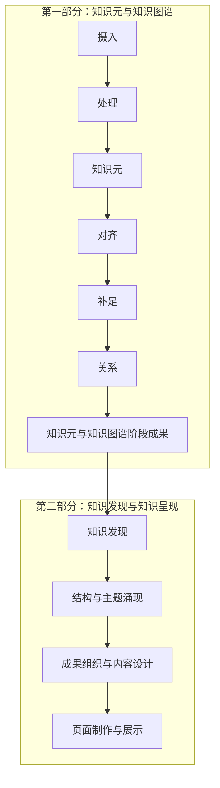

# 工作流程调整过程报告与用户修订记录

版本：v1.0  
记录日期：2026-09-09  
记录依据：本任务中的用户消息与方案讨论  
状态：前七节保留最初方案讨论快照；REV-005 已授权并实施本地重构，当前要求与验收见关联文件。

本文件保存用户原话、目的解释和方案变化，后续沿用本文件追加修订记录。原话不因后续总结而覆盖。当前有效要求集中见 [current-requirements.md](current-requirements.md)；具体实施及其验证完成后，另在现有系统升级日志中记录实际结果。

## 一、调整背景

讨论开始时，仓库采用生产、成长、治理三条循环，按事件进入相应 Skill。`ingest` 同时包含来源登记、语义阅读、候选判断和类型化写回；知识发现、层级演化也在现行路由内。

用户要求先明确初期范围和阶段责任，以语义分析为基础，并能在业务目录中查看处理过程、知识成果及完成情况。因此，本次讨论从“按事件分流”转向“明确阶段、依次执行、分别留存过程和结果”。

本报告记录的是这一调整的提出与讨论过程，不表示原有规则、Skill、数据或页面已经完成改造。

## 二、用户原话与目的解释

### REV-001：首次提出范围和记录要求

日期：2026-09-09。此消息后该轮被中断，随后用户补充了完整版本；两条均保留，不把中断消息记为已执行任务。

用户原话：

> 目前的流程需要限定。0项目要以语义分析为基础，尽量少用代码和脚本。1初期目标只进行知识元的摄入和关系关联，暂不进行知识发现的步骤。2每个环节都要按阶段执行。并形成相应的结果。（比如03-processing处理了什么，结果是怎样的，要保存在该文件夹，比如04）3我提出的修订意见要专门进行存储。原话和目的进行保存和总结。

目的解释（Agent 总结）：

- 让阅读、分析和判断成为工作的主体，减少脚本及其运行流程对研究工作的支配。
- 把初期目标限定为知识元及关系建设。
- 每阶段形成可阅读、可追溯的结果，并在相应业务目录保存。
- 建立专门的用户修订记录，区分原话与解释。

### REV-002：明确六阶段路径及只审阅边界

日期：2026-09-09。此条是 REV-001 的完整补充版本。

用户原话：

> 目前的流程需要限定。0项目要以语义分析为基础，尽量少用代码和脚本。1初期目标只进行知识元的摄入和关系关联，暂不进行知识发现的步骤。2每个环节都要按阶段执行。并形成相应的结果。（比如03-processing处理了什么，结果是怎样的，要保存在该文件夹，比如04-knowledge分析出了哪些知识元，完成度如何）3我提出的修订意见要专门进行存储。原话和目的进行保存和总结。4执行步骤还不够清晰，需要修订 按照 摄入-处理-知识元-对齐-补足-关系的路径进行调整。
> 你先看下要怎么做，先不要改。

目的解释（Agent 总结）：

- 明确六个阶段的先后顺序和职责，解决当前步骤不清晰的问题。
- 使 `03-processing` 能说明处理范围与分析结果，使 `04-knowledge` 能说明知识元产出和完成情况。
- 在实施前先审阅现状、提出调整方案；本条未授权修改实际流程。

### REV-003：明确两大部分、最终展示及版本原则

日期：2026-09-09。

用户原话：

> 知识发现和涌现是之后的步骤，最后有页面展示。
> 每个阶段形成的过程文档专门存储，最终版本和结果也要专门存储。原则上不新建文献，只做版本更迭。
> 总体上分为知识元&知识图谱/知识发现&知识呈现这两大部分。

目的解释（Agent 总结）：

- 知识发现和涌现属于后续正式工作，初期暂不开展，并非从总体流程中取消。
- 第一部分建设知识元与知识图谱；第二部分开展知识发现与知识呈现，最终包含页面展示。
- 每阶段的过程文档与最终成果分别保存，避免讨论、分析、暂定内容与当前有效成果混在一起。
- 同一对象沿用固定文档进行版本更迭，避免按轮次或日期不断复制同用途文档。

解释边界：用户原话中的“原则上不新建文献”在方案中暂按“同一对象不反复新建同用途文档，沿用固定文件进行版本更迭”落实；这不构成覆盖原始来源的授权，也不扩展为永久禁止引入必要来源。具体目录名称和第二部分的内部步骤仍属于 Agent 建议。

### REV-004：授权将调整过程形成报告

日期：2026-09-09。

用户原话：

> 把这个调整的过程形成报告。记录下来。

目的解释（Agent 总结）：

- 将此前停留在会话中的调整过程持久保存，便于后续核对要求与实施依据。
- 本次授权落实为本报告、当前要求汇总及必要的导航链接；实际流程、Skill 和知识内容的改造仍未实施。

## 三、方案如何演变

| 讨论节点 | 形成的认识或建议 | 当前地位 |
|---|---|---|
| 现状审阅 | 现行事件路由、ingest 内部职责和完整层级挂载要求，与用户限定的阶段路径存在冲突 | 后续实施时需要解决 |
| 第一轮方案 | 建议按“摄入—处理—知识元—对齐—补足—关系”执行，逐阶段保存范围、判断、产出、状态与缺口 | 六阶段路径来自用户；具体完成标准为 Agent 建议 |
| 第一轮记录建议 | 曾建议每次修订单独新建记录 | 被后续固定文档、持续版本更迭的方案替代，未实施 |
| 第二轮补充 | 知识发现与涌现位于后续阶段，最终有页面展示；总体分为两大部分 | 用户明确要求 |
| 第二轮存储方案 | 建议业务目录内分别设置过程与结果位置，实际成果维护唯一当前版本 | 存储分离是用户要求；目录命名尚属建议 |
| 第二轮记录建议 | 采用固定的 user-revisions.md 保存原话与演变，current-requirements.md 汇总当前要求 | 本次记录任务已落实 |

## 四、总体路径与阶段职责建议

第一部分的六阶段顺序来自 REV-002，两大部分及最终页面展示来自 REV-003。第二部分图示中的具体拆分和顺序是 Agent 的工作建议，尚未作为已实施流程。

| 阶段 | 过程记录重点 | 阶段结果重点 |
|---|---|---|
| 摄入 | 来源、版本、资产、处理范围与缺失材料 | 可进入阅读的来源清单及范围 |
| 处理 | 语义阅读、来源定位、论述与语境分析、歧义和遗漏 | 处理了什么、如何理解、提取依据及未解决问题 |
| 知识元 | 对象边界、类型判断、初步重复筛查、成稿依据 | 新增、更新、暂缓对象及有来源的知识元初稿 |
| 对齐 | 名称、别名、身份、年代、版本与重复或冲突的核对 | 对齐结论、依据、具体改动及保留分歧 |
| 补足 | 围绕既有知识元缺口进行必要阅读和补证 | 补充内容、来源、原书与外部补充的区分及剩余缺口 |
| 关系 | 端点、类型、方向、时间范围与具体证据的语义审查 | 已建立、待证、否决的关系及理由 |

对齐暂按对象同一性和表述一致性理解，不等同于全部事实验证，也不强制进行 Theme/Topic 层级归属。阶段结果保存后再进入下一阶段；无须补足或无证据充分的关系时，可以如实形成“已审查，无新增”结果。

## 五、存储与版本方案建议

过程文档解释“怎样分析和判断”；结果文档说明“当前结论、完成状态和成果位置”；实际知识元、正式关系、发现结论与页面在固定位置维护。结果文档引用实际成果，不再复制一套正文。

建议在 `03-processing`、`04-knowledge`、`05-outputs` 内分别组织对应业务的过程和结果，必要时采用 `process/` 与 `results/`；发现与涌现的落点结合现有 `04-knowledge/structure/` 决定。具体目录结构尚未创建或改造。

同一对象的文档使用固定路径，避免“最终版、最终修订版”或逐轮日期副本。过程记录保留判断变化，结果文件维护当前有效内容；Git 提交后可以进一步保留版本差异，但提交与推送仍须按授权执行。原始来源本体继续保留，不因版本管理而覆盖。

## 六、后续实际改造涉及的范围

- `AGENTS.md` 与 `.agents/pipeline.md`：写明初期范围、两部分结构和六阶段执行约束。
- `01-domain/workflow-overrides.md`：解决初期暂停知识发现与现行完整五级挂载要求之间的冲突。
- 相关 Skill：明确摄入、处理、知识元、对齐、补足、关系的职责、交接和阶段结果；不机械地为六阶段新增六套 Skill 或脚本。
- 业务目录说明：明确过程文档、结果文档和当前成果的唯一位置及引用方式。
- 必要校验：与新契约保持一致，保留来源和证据可追溯性，减少不必要的脚本编排。

以上属于后续实施范围，本次报告没有执行这些修改。

## 七、本次记录的完成边界

- 已保存本轮相关用户原话、目的解释、方案变化与尚未实施事项。
- 已形成独立的当前要求汇总，并建立运行层导航入口。
- 未修改实际执行流程、Skill、知识元、关系、来源或页面。
- 未重新进行来源语义验收，未提交或推送 Git；报告存在不等于流程改造完成。

## 八、持续记录与实施授权

### REV-005：Codex 单入口重构

日期：2026-09-09。

用户原话：

> 之后所有的我的对话和修订意见都记下来。
> 以agents.md也就是目前使用的codex为核心，整理工作流和skills系统。
> 目前系统中存在.claude .codex .agents 等多个系统。能删除删除，整个系统不要有歧义。
> 现在开始重构系统。不要冗余

目的解释（Agent 总结）：持续保存本项目后续可见的每条用户消息，不仅限于规则修订；以 AGENTS.md 为唯一总入口，Codex 为执行客户端，消除重复适配、重叠技能和相互冲突的流程规定。

授权范围：开始实施此前讨论的工作流与 Skill 重构，允许删除确认不再使用的系统入口、重复规范与适配；保留来源、知识成果及不可替代历史证据。此授权取代 REV-002 的“先不要改”阶段边界；不自动包含新的 Git 提交和推送。

记录边界：从本条开始，对本项目会话中 Agent 实际可见的后续用户消息逐条保留原话，再另写理解与处理结果；不声称能读取未提供的其他会话、系统消息或后台私有数据。无修订的普通消息也记录，不把它们自动升级为规则。

实施过程和验收结果统一见 [system-upgrade-log.md](system-upgrade-log.md)，本文件不复制执行日志。

REV-005 处理结果：本地 v6.0.0 重构已完成，当前系统与 Skill 边界见 AGENTS.md；验证结果见系统升级日志。未提交或推送。

### REV-006：目录结构与现行工作流的匹配评估

日期：2026-09-09。

用户原话：

> 目录结构是否需要根据现行工作流进行调整？

目的解释（Agent 总结）：检查当前目录是否真实反映六阶段工作流及两部分目标，识别历史目录分类、过程与结果落点中的歧义，评估必要的最小调整。

处理范围：目录与契约评估，记录结论；本轮不移动来源、知识或系统文件，不把询问自动解释为再次迁移目录的命令。

处理结果：需要局部目录与导航收口。保留 01–06 顶层业务目录和知识元唯一正文路径；建议扁平化八个 Skill 目录，摄入过程记录离开来源只追加区域，统一过程/结果命名，收敛输出层和空的全局运行目录。现行命名规范与输出 README 仍含旧目录说明，上一轮重构的机械检查未覆盖这类文字残留。具体发现见系统升级日志的目录评估节；本次未实施这些迁移。

### REV-007：从 01 开始实施目录修订

日期：2026-09-09。

用户原话：

> 应该从01开始吧，现在开始修订。

目的解释（Agent 总结）：目录修订应从 01-domain 的领域约束与命名规范开始，再依次落实后续业务目录，实施 REV-006 中评估的必要调整。

授权范围：修订现行目录职责与导航、迁移 Skill 并修复依赖，清理已核实无内容且无用途的旧目录；保留来源、知识成果和历史证据。未授权本次 Git 提交与推送。

处理结果：本地 v6.0.1 目录修订已完成，从 01-domain 起依次更新 01–06 职责，八个 Skill 已扁平迁移，冗余空目录已清理；246 项测试通过。过程、迁移映射与验收统一见 system-upgrade-log.md；未提交或推送。

### REV-008：质疑项目初期的高版本号

日期：2026-09-09。

用户原话：

> 各个文档的版本怎么那么高？这个项目还没开始

目的解释（Agent 总结）：指出当前高版本号与项目尚处于启动阶段的实际状态不符，需要解释版本来源，避免将继承系统的改版次数表现为本项目成熟度。

处理范围：核对与解释版本来源；本条询问不自动授权全仓版本重编号。

核对结果：高版本号混合了旧系统沿用的文档版本（例如 taxonomy-registry v4.0、语义协议 v4.2）和 Agent 在本项目两次系统整理中标注的 v6.0.0/v6.0.1。它们不是本项目研究成果迭代次数；将这些编号直接用于项目总入口与普通文档容易造成成熟度误解，属于版本管理处理不当。

建议：本项目初始化基线使用 v0.1.0；普通说明与规则文档取消独立数字版本，保留必要更新日期，以 Git 历史和既有修订日志追溯。机器读取的 schema/protocol 版本仅为兼容保留，不作项目进度标志；历史日志保留原编号并解释来源。当前实际状态为工作流初始化，已有第一章试点草稿不等于正式研究或验收完成。本轮已解释并记录，尚未更改版本编号。

### REV-009：知识涌现生成层级，而非预设层级

日期：2026-09-09。

用户原话：

> 你好像没有理解知识发现的机制，包括知识涌现。应该是通过知识涌现，哪些知识元组成了topic，哪些topic组成了them，哪些主题构成了维度，哪些维度构成了领域。不是实现设定的。你深度理解一下

目的解释（初步，待本轮审读后补充）：纠正 Agent 将知识结构理解为预设分类框架的偏差。具体 Topic、Theme、Dimension、Domain 应从知识元及其关系的分析中逐级涌现；不得先定结构再把知识元塞入框架。用户原话保留，解释中将 them 理解为 Theme，将“不是实现设定的”按上下文理解为“不是事先设定的”。

处理范围：深入审读现行层级与发现契约，厘清机制及冲突并记录；不启动知识发现、不修改既有知识成果。

处理结果：已核实预设 A–E 维度、预设 Domain、优先挂载及数量晋升门槛与用户所述机制不符，10 个试点 KU 的现有归属不能视为涌现结果。已在 current-requirements.md 记录 R-14，详细理解与冲突见 system-upgrade-log.md 的 REV-009 审读节。本轮只形成机制纠正与审读记录，未改写研究成果或启动知识发现。

### REV-010：按空项目审查完整工作流

日期：2026-09-09。

用户原话：

> 你再检查一下 agents.md和整个pipline和skills工作流是否合理
> 这是个空项目还没有执行，不要预先设定许多内容，但skills和前后关联的工作流的功能，工作内容，产出结果等规则要基本完备。

目的解释：以尚未正式执行的空项目为设计基线，不预设研究内容、具体层级或研究完成状态；同时要求 AGENTS、pipeline 和 Skills 的职责、输入、操作、产出及前后交接基本完备。

处理范围：审查并记录问题与必要修订方案；不运行摄入、发现或成果生成，不因空项目定位自动删除磁盘遗留材料。

处理结果：已完成 AGENTS、pipeline、八个 Skill 及关键直接契约审读，判断“主体分工可保留，但空项目起步、逐级涌现、阶段状态及交接/回退尚不完备”。具体问题、八 Skill 合同目标与修订顺序记入 system-upgrade-log.md 的 REV-010；需求索引已标记当前空项目定位和待实施事项。本轮未修改运行规则或研究成果。

### REV-011：检查过度设计、门禁与冗余，保留页面样式

日期：2026-09-09。

用户原话：

> 整个流程有没有过度设计，过多的门禁和审核？是否有冗余？页面样式可以保留，但是要根据新的数据进行调整。

目的解释：在 REV-010 的系统审查中进一步辨认不必要的门禁、审核与重复工件；保留现有页面视觉样式，但其内容、指标、筛选、层级及交互绑定必须使用本项目实际新数据，不继承旧项目研究结论。

处理范围：扩展当前审查并记录简化取舍和页面约束；不凭空生成研究数据，不因审查自动删除来源、历史证据或页面资源。

处理结果：确认存在批量机器流程默认化、重复结果工件和合同描述、历史兼容占据主流程等负担；同时现行规则已经取消默认逐阶段用户审批，不能误报为所有环节都要求批准。已形成保留基本证据条件、按需启用复杂检查的精简方案，页面保留样式并按新数据更新的要求已入需求索引。具体见 system-upgrade-log.md REV-011；本轮尚未实施精简或改页面。

### REV-012：先提交同步，再精简调整

日期：2026-09-09。

用户原话：

> 先提交并同步仓库。然后开始精简调整。

目的与授权：先提交并推送当前重构与审查记录，核验 main 与远端一致，再实施 REV-008 至 REV-011 已记录的版本、空项目、涌现、工作流精简及页面数据边界调整。后续精简修改先在本地完成，不将本次“先同步”自动扩大为再次发布。
