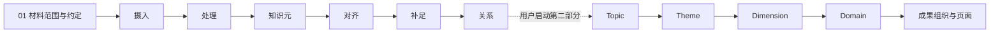

# 《赞助人与画家》知识系统

项目初始化版本：0.1.0。第一章已逐行阅读，按 REV-032–034 完成摄入处理、知识元登记及带未决项的初步对齐定稿；目前补足进行中，REV-045 完成字段化样例与关系表达核对，深化那不勒斯并补入格列高利十五世内容稿；身份、版本、范围与检索缺口在结果和各卡中单列。见 [第一章当前结果与目录](04-knowledge/results/patrons-and-painters-chp-1.md)。第六章后置，知识涌现与页面暂停；遗留、试填内容保留供追溯，未接收内容不计作本项目有效成果。

[AGENTS.md](AGENTS.md) 是 Codex 唯一总入口；[pipeline](.agents/pipeline.md) 定义交接，八个 Skill 在 `.agents/skills/`。当前规则和文档不再各自累计大版本号。

采用渐进式读取与分布记录：总入口定位任务和 Skill，按需读其直接参考；过程在 03 的任务包分阶段记录，04 保存当前成果与结果，06 保存用户原话和系统治理。结果原位更新，历史判断保留，入口不复制整套报告。详细读取与记录规则只在 AGENTS 维护。

结构从知识及关系中逐级涌现，不预设 A–E 维度或具体 Domain。可在实际形成的层次停止，未开展不是缺陷。

| 目录 | 职责 |
|---|---|
| 01-domain | 材料范围、表达与命名约定 |
| 02-sources | 来源资产与登记 |
| 03-processing | 摄入至关系及后续发现的过程记录；摄入处理结果与覆盖依据 |
| 04-knowledge | 知识元、关系、证据、涌现结构及当前结果说明 |
| 05-outputs | 呈现过程、定稿与页面 |
| 06-runtime | 用户记录、治理与必要运行状态 |

[有效成果登记](04-knowledge/accepted.yml) 已登记第一章来源支持成果；计数、来源边界及未解决问题以第一章结果为准。后续实际成稿或结构成立时登记引用，不复制正文。
[页面](05-outputs/knowledge-graph.html) 保留视觉样式，本次按用户要求暂停刷新，因此尚未呈现第一章新成果。

日常直接分析、写作并核对受影响内容；外部核验、批量预检、恢复状态和测试按需启用。只用 main，Git 提交/推送须有明确授权。

用户原话见 [user-revisions.md](06-runtime/governance/user-revisions.md)，有效要求见 [current-requirements.md](06-runtime/governance/current-requirements.md)，系统过程与结果见 [system-upgrade-log.md](06-runtime/governance/system-upgrade-log.md)。
