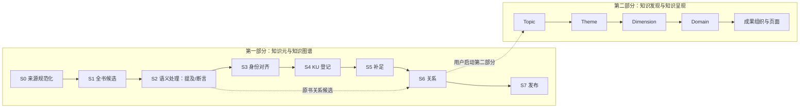

# 《赞助人与画家》知识系统

项目初始化版本：0.1.0。第一章作为知识元与知识图谱样例，进度见[第一章当前结果](04-knowledge/results/patrons-and-painters-chp-1.md)；章前材料已完成摄入、处理并进行知识元登记，见[章前当前结果](04-knowledge/results/patrons-and-painters-front-matter.md)。第六章后置，知识涌现与页面暂停；未接收内容不计作有效成果。

[AGENTS.md](AGENTS.md) 是 Codex 唯一总入口；[pipeline](.agents/pipeline.md) 定义交接，八个 Skill 在 `.agents/skills/`。当前规则和文档不再各自累计大版本号。

采用渐进式读取与分布记录：总入口定位任务和 Skill，按需读其直接参考；过程在 03 的任务包分阶段记录，04 保存当前成果与结果，06 保存用户原话和系统治理。结果原位更新，历史判断保留，入口不复制整套报告。详细读取与记录规则只在 AGENTS 维护。

第一部分按 **S0–S7**（来源 → 全书候选 → 语义处理 → 对齐 → KU 登记 → 补足 → 关系 → 发布）执行，详见 [pipeline](.agents/pipeline.md)。关系候选在语义处理时同步记录，随后在关系阶段裁决；候选不是正式边，外部补足也不覆盖原书表达。过渡期说明：S0–S6 产物的目标存放地是 `04-knowledge/tables/`，但目前 `build_tables.py` 仍从卡片 frontmatter 与 `accepted.yml` 导出这些表，尚未反转成唯一事实源。结构从知识元及正式关系中逐级涌现，不预设 Topic、Theme、Dimension、Domain 或层级归属；可在实际形成的层次停止，未开展不是缺陷。

| 目录 | 职责 |
|---|---|
| 01-domain | 材料范围、表达与命名约定 |
| 02-sources | 来源资产与登记 |
| 03-processing | 摄入至关系及后续发现的过程记录；摄入处理结果与覆盖依据 |
| 04-knowledge | 知识元、关系、证据、涌现结构及当前结果说明 |
| 05-outputs | 呈现过程、定稿与页面 |
| 06-runtime | 用户记录、治理与必要运行状态 |
| [07-paper](07-paper/README.md) | 论文定位、写作与实验建议、投稿期刊及分区依据；不新增研究阶段 |

[有效成果登记](04-knowledge/accepted.yml) 汇集第一章与章前材料已接收的来源支持成果；各范围的完成状态以对应任务结果为准。知识元登记不表示全部对齐、补足或关系已完成。
[页面](05-outputs/knowledge-graph.html) 保留视觉样式，本次按用户要求暂停刷新，因此尚未呈现第一章新成果。

日常直接分析、写作并核对受影响内容；外部核验、批量预检、恢复状态和测试按需启用。只用 main，Git 提交/推送须有明确授权。

用户原话与有效要求见 [current-requirements.md](06-runtime/governance/current-requirements.md)，规则变更见 [CHANGELOG.md](06-runtime/governance/CHANGELOG.md)（`user-revisions.md`、`system-upgrade-log.md` 已冻结为只读历史）。
