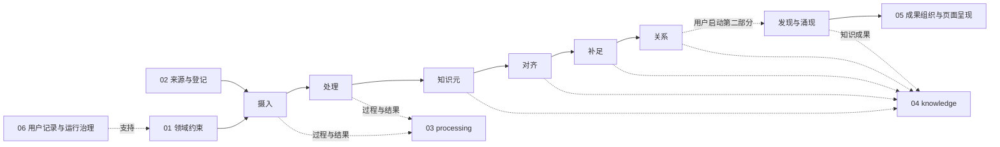

# 《赞助人与画家》知识系统

当前版本：v6.0.1。以 Francis Haskell《Patrons and Painters》为来源基础，研究巴洛克时期意大利艺术与社会。

## 从哪里开始

- [AGENTS.md](AGENTS.md)：Codex 唯一总入口，规定目标、边界与记录义务。
- [分阶段工作流](.agents/pipeline.md)：阶段职责、交接与过程/结果存储。
- `.agents/skills/`：同一系统的唯一技能目录；没有另一套客户端规则。
- [用户原话与修订记录](06-runtime/governance/user-revisions.md)与[当前要求](06-runtime/governance/current-requirements.md)。

## 工作范围

第一部分：知识元与知识图谱，依次为 **摄入 → 处理 → 知识元 → 对齐 → 补足 → 关系**。
第二部分：知识发现与知识呈现，后续开展发现、涌现和成果组织，最终形成页面。

当前执行第一部分，第二部分不自动启动。语义分析是主体，脚本仅用于必要辅助。

## 目录

| 目录 | 内容 |
|---|---|
| 01-domain | 领域对象、术语与适用边界 |
| 02-sources | 原始来源、版本资产与登记 |
| 03-processing | 摄入与处理的过程、覆盖证据和阶段结果 |
| 04-knowledge | 知识过程、阶段结果、知识元、关系与证据 |
| 05-outputs | 呈现过程、定稿与页面 |
| 06-runtime | 对话记录、治理和必要机器状态 |

各阶段过程与结果分开，固定路径持续更迭，实际成果只保留一个当前版本。原始来源不覆盖。

从 01 的领域约束开始，目录职责见 [命名规范](01-domain/naming-conventions.md)。目录编号不等同于执行阶段：

## 当前研究状态

第一章已有 10 个知识元和 5 个断言登记。历史候选仍为 approved，不能据此宣称写回状态收口、身份对齐、补足或关系阶段已完成。完整 Theme/Topic 挂载当前暂不开展。

现存展示页面属于既有模板或机械投影，不等于第二部分已完成；当前知识入口见 [知识导航](05-outputs/index/index.md)。

## 检查与维护

日常优先直接审阅相关文本；必要时运行 `python scripts/validate_processing_package.py <包目录>` 或定向检查。
系统改造收尾使用 `python scripts/run_sync_closure.py --refresh-generated --full`；经授权提交后、发布前使用 `--check-generated` 检查提交基线。

运行环境权限以 Codex 实际配置为准，本项目不宣称自动 Hook 已加载。只使用 main；Git 提交和推送需明确授权。
